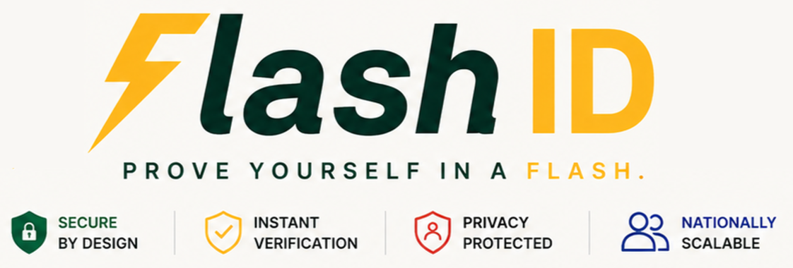

  

Smart Digital ID Wallet (SDIW) is a secure national-scale digital identity platform that enables citizens to store, manage, and verify official identity credentials digitally. Citizens can securely store cryptographically signed credentials such as national IDs and driver's licences, then present them through QR codes for instant real-time verification.

<code></code>
<code></code>
<code></code>
<code></code>
<code></code>
<code></code>
<code></code>
<code></code>
<code></code>
<code></code>

## 📄 Table of Contents

- [Table of Contents](#-table-of-contents)
- [Demo Videos](#-demo-videos)
- [Contact Us](#-contact-us)
- [Documentation](#-documentation)
- [Team Profiles](#-team-profiles)
- [Git Structure](#-git-structure)
- [Branching Strategy](#-branching-strategy)
- [Quality Badges](#️-quality-badges)

---

## 🎥 Demo Videos

- [Demo 1 Video](#)

- [Demo 2 Video](#)

- [Demo 3 Video](#)

- [Demo 4 Video](#)

---

## 📞 Contact Us

Want to contact us or learn more about the project?

📧 t3chtitansgo@gmail.com

---

## 📑 Documentation

<strong>📋 Demo 1 Documentation</strong>

🔗 [SRS](docs/documentation/demo_1/srs.md)  
🔗 [Brand style guide](docs/Branding_Document_v1.0.pdf)  
🔗 [Wireframes](docs/documentation/demo_1/coding_standards.md)  
🔗 [Research Document](docs/research-doc.md)  

<strong>📋 Demo 2 Documentation</strong>

<strong>📋 Demo 3 Documentation</strong>

<strong>📋 Demo 4 Documentation</strong>

---

## 🤝 Team Profiles

<table>
  <tr>
    <th width="30%">Name</th>
    <th width="20%">Role & LinkedIn</th>
    <th width="50%">Description</th>
  </tr>

  <tr>
    <td width="30%">
      <strong>Unathi Tshakalisa</strong> 
      
    </td>
    <td width="20%">
      <code>Team Leader</code> 
      <code>Full Stack</code> 
      
    </td>
    <td width="50%">
      Passionate about building practical and accessible technology solutions with a strong focus on UI/UX, collaboration, and problem solving.
    </td>
  </tr>

  <tr>
    <td width="30%">
      <strong>Zaynab Samir</strong> 
      
    </td>
    <td width="20%">
      <code>Cybersecurity</code> 
      <code>Full Stack</code> 
      
    </td>
    <td width="50%">
      Skilled across frontend and backend development with strong interests in cybersecurity, simulations, and software testing.
    </td>
  </tr>

  <tr>
    <td width="30%">
      <strong>Nathan Chisadza</strong> 
      
    </td>
    <td width="20%">
      <code>Algorithms</code> 
      <code>Full Stack</code> 
      
    </td>
    <td width="50%">
      Strong algorithmic and systems background with experience in React, C#, and collaborative software engineering.
    </td>
  </tr>

  <tr>
    <td width="30%">
      <strong>Ryan Liao</strong> 
      
    </td>
    <td width="20%">
      <code>Mobile Systems</code> 
      <code>Frontend Engineering</code> 
      
    </td>
    <td width="50%">
      Junior Software Engineer experienced in production web and mobile applications with strong frontend engineering skills.
    </td>
  </tr>

  <tr>
    <td width="30%">
      <strong>Dominiqu Nigatu</strong> 
      
    </td>
    <td width="20%">
      <code>Integration Systems</code> 
      <code>UI Engineering</code> 
      
    </td>
    <td width="50%">
      Delivery-focused developer interested in scalable systems, dependable software, and clean architecture.
    </td>
  </tr>

</table>

---

## 📁 Git Structure

Our repository follows a modular monorepo structure where different components are organised into dedicated directories.

- **frontend/** → Next.js web portals for administrators and verifiers.
- **mobile/** → React Native citizen wallet application.
- **backend/** → ASP.NET Core APIs and business logic.
- **database/** → SQL schemas, migrations, and database configuration.
- **infrastructure/** → Azure deployment and Docker configuration files.
- **docs/** → Project documentation, reports, and assets.

| Branch | Purpose |
|---|---|
| `main` | Production-ready code — merged into before each demo |
| `dev` | Integration branch — all features merge here first |
| `feature/` | New features e.g. `feature/upload-institution` |
| `fix/` | Bug fixes e.g. `fix/cors-policy` |
| `docs/` | Documentation updates e.g. `docs/architectural-requirements` |
| `tests/` | Testing additions e.g. `tests/institution-validator` |

---

## 🌳 Branching Strategy

We follow a structured GitFlow branching model to ensure efficient collaboration and stable releases.

### Main Branches

- **`main`** → Stable production-ready branch.
- **`dev`** → Primary development and integration branch.

### Workflow

- Feature branches are created from `dev`
- Pull requests require peer review before merge
- Completed features are merged back into `dev`
- Stable milestones are merged into `main`

---

##  Badges

### Code Coverage

### Build

### Requirements

### Issue Tracking

