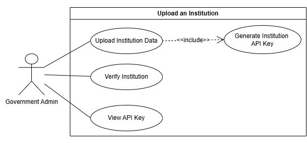
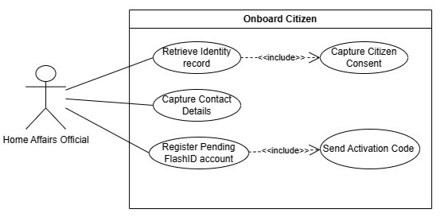
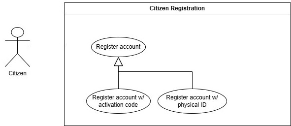
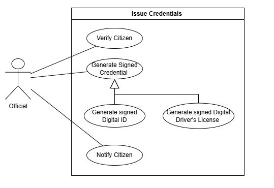
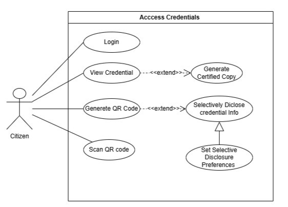
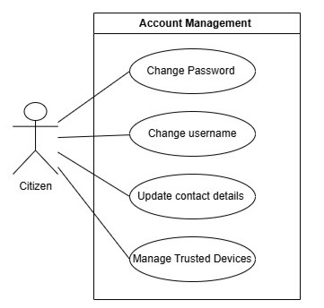
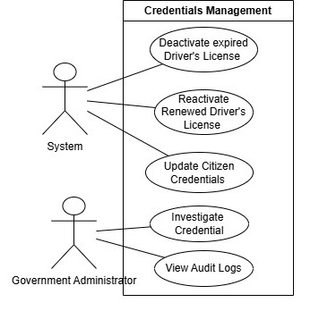

# Software Requirements Specification (SRS)
# FlashID — South African Digital ID Wallet

> COS 301 Capstone Project 2026  
> Team: Tech Titans  
> Client: Agile Bridge (Pty) Ltd  
> Version: 0.1 Draft

---

# Table of Contents

1. Introduction  
2. System Overview  
3. User Characteristics and Actors  
4. Functional Requirements  
5. Use Cases  
6. API Service Contracts  
7. Domain Model  
8. Architectural Requirements  
9. Technology Requirements  
10. Constraints and Assumptions  
11. Non-Functional Requirements  
12. Future Enhancements  

---

# 1. Introduction

## 1.1 Purpose

FlashID is a secure South African Digital Identity Wallet system that enables citizens to digitally store, manage, and present government-issued credentials such as South African IDs and driver's licences.

The system aims to reduce dependency on fragile physical identity documents and replace insecure identity-sharing practices such as sending ID copies over WhatsApp or email.

The solution provides:
- Secure digital identity storage
- Cryptographically signed credentials
- QR-based identity verification
- Role-based administrative management
- Real-time credential validation
- Comprehensive audit logging

The system consists of:
- A citizen mobile wallet application
- A web-based verification portal
- A government administrative dashboard
- An officials administrative dashboard

---

## 1.2 Business Problem

In South Africa, identity verification still heavily depends on physical documentation. Lost, stolen, or forged identity documents create major risks for citizens, government institutions, banks, hospitals, and law enforcement agencies.

FlashID addresses these issues through:
- Digital identity credentials
- Cryptographic verification
- Real-time QR validation
- Secure mobile credential storage
- Controlled identity disclosure

---

## 1.3 Scope

The FlashID prototype will:
- Allow citizens to onboard and access a digital identity wallet
- Allow authorized government administrators to issue credentials
- Allow officials to verify credentials through QR scanning
- Support credential revocation and audit tracking
- Demonstrate secure, scalable identity verification workflows

The prototype will simulate institutional integrations using mock or controlled government services.

---

# 2. System Overview

FlashID is a multi-platform digital identity ecosystem consisting of:

| Platform | Purpose |
|---|---|
| Citizen Mobile App | Stores and presents digital credentials |
| Official Verification Portal | Allows verification of credentials |
| Government Admin Dashboard | Allows credential issuance and management |

The system follows CLEAN Architecture principles to separate:
- Business logic
- Infrastructure concerns
- Presentation logic
- Data persistence

---

# 3. User Characteristics and Actors

## 3.1 Citizen

A South African citizen who:
- Registers for FlashID
- Stores digital credentials
- Authenticates securely
- Presents credentials using QR codes
- Scan QR codes
- Receives status notifications

---

## 3.2 Government Administrator

Authorized personnel who:
- Issue credentials
- Revoke credentials
- Manage citizen onboarding
- View audit logs
- Manage verification workflows

---

## 3.3 Official

External authorized entities such as:
- Banks
- Hospitals
- Police officers
- Insurance agencies
- DLTC

Officials may:
- Verify credentials
- Receive limited verification data
- Validate authenticity in real time
- Communicate with FlashID to send citizen data to the system

---

# 4. Functional Requirements

---

# 4.1 Authentication and User Management Subsystem

## R1: User Registration and Authentication

The FlashID system shall provide secure authentication and identity onboarding functionality for citizens, government administrators, and verification officials.

---

### R1.1: Citizen Registration

The system shall allow South African citizens to securely register for a FlashID account.

#### R1.1.1:
The system shall allow citizens to register using:
- South African ID number
- Mobile number
- Email address

#### R1.1.2:
The system shall validate:
- ID number format
- Email format
- Password complexity requirements

#### R1.1.3:
The system shall prevent duplicate citizen registrations using the same South African ID number.

#### R1.1.4:
The system shall require citizens to verify their mobile number using OTP verification.

#### R1.1.5:
The system shall securely store citizen registration information in the backend database.

---

### R1.2: Citizen Login

The system shall provide secure login functionality for registered citizens.

#### R1.2.1:
The system shall allow login using:
- Email and password
- Mobile number and password

#### R1.2.2:
The system shall support biometric authentication including:
- Fingerprint authentication
- Facial recognition authentication

#### R1.2.3:
The system shall issue JWT authentication tokens upon successful login.

#### R1.2.4:
The system shall automatically expire inactive user sessions after a configurable timeout period.

#### R1.2.5:
The system shall securely log citizens out of all active sessions when requested.

---

### R1.3: Government Administrator Authentication

The system shall provide secure authentication for government administrators.

#### R1.3.1:
The system shall restrict administrator access to authorized personnel only.

#### R1.3.2:
The system shall support role-based administrator permissions.

#### R1.3.3:
The system shall support multi-factor authentication for administrators.

#### R1.3.4:
The system shall maintain audit logs of all administrator login attempts.

---

### R1.4: Verification Official Authentication

The system shall provide authentication mechanisms for verification officials.

#### R1.4.1:
The system shall allow officials to authenticate before performing credential verification.

#### R1.4.2:
The system shall associate each verification action with the authenticated official account.

---

# 4.2 Credential Management Subsystem

## R2: Digital Credential Issuance and Management

The FlashID system shall support the issuance, storage, management, and revocation of digital credentials.

---

### R2.1: Digital ID Credential Issuance

The system shall allow government administrators to issue digital identity credentials.

#### R2.1.1:
The system shall allow administrators to issue South African digital identity credentials to registered citizens.

#### R2.1.2:
The system shall generate a unique credential identifier for every issued credential.

#### R2.1.3:
The system shall cryptographically sign each credential using secure public/private key cryptography.

#### R2.1.4:
The system shall associate issued credentials with the correct citizen profile.

#### R2.1.5:
The system shall notify citizens when credentials have been successfully issued.

---

### R2.2: Driver’s Licence Credential Issuance

The system shall allow government administrators to issue digital driver’s licence credentials.

#### R2.2.1:
The system shall store:
- Licence number
- Vehicle classes
- Restrictions
- Expiry date
- Issuing office

#### R2.2.2:
The system shall automatically mark expired licences as inactive.

#### R2.2.3:
The system shall allow administrators to renew expired driver’s licences.

---

### R2.3: Credential Revocation

The system shall support credential revocation workflows.

#### R2.3.1:
The system shall allow administrators to revoke compromised credentials.

#### R2.3.2:
The system shall allow administrators to suspend credentials under investigation.

#### R2.3.3:
The system shall maintain credential statuses including:
- Active
- Suspended
- Revoked
- Expired

#### R2.3.4:
The system shall notify citizens when credential statuses change.

---

### R2.4: Secure Credential Storage

The system shall securely store citizen credentials.

#### R2.4.1:
The mobile application shall securely store credentials using encrypted local storage.

#### R2.4.2:
The system shall prevent unauthorized access to stored credentials.

#### R2.4.3:
The system shall support offline credential viewing for previously issued credentials.

#### R2.4.4:
The system shall prevent raw personally identifiable information from being exposed in QR payloads.

---

# 4.3 QR Verification Subsystem

## R3: Real-Time Credential Verification

The FlashID system shall support secure QR-based identity verification.

---

### R3.1: QR Code Generation

The system shall generate secure QR codes for credential presentation.

#### R3.1.1:
The system shall generate unique QR payloads linked to specific credentials.

#### R3.1.2:
The system shall cryptographically sign QR payloads.

#### R3.1.3:
The system shall generate time-limited QR verification sessions.

#### R3.1.4:
The QR payload shall not contain raw personally identifiable information.

---

### R3.2: QR Credential Verification

The system shall support real-time credential validation.

#### R3.2.1:
The system shall allow officials to scan QR codes using the verification portal.

#### R3.2.2:
The system shall validate:
- Credential authenticity
- Credential status
- Credential signature integrity

#### R3.2.3:
The system shall display verification results in real time.

#### R3.2.4:
The system shall reject:
- Expired credentials
- Revoked credentials
- Tampered credentials

#### R3.2.5:
The system shall automatically expire verification sessions after a predefined period.

---

### R3.3: Verification Logging

The system shall maintain verification audit records.

#### R3.3.1:
The system shall log:
- Verification timestamp
- Official identity
- Credential reference
- Verification outcome

#### R3.3.2:
The system shall associate verification records with authenticated officials.

---

# 4.4 Role-Based Access Control Subsystem

## R4: Role-Based Access Control

The FlashID system shall enforce secure role separation and authorization controls.

---

### R4.1: Role Separation

The system shall support the following roles:
- Citizen
- Verification Official
- Government Administrator

#### R4.1.1:
The system shall restrict users to functionality permitted by their assigned role.

#### R4.1.2:
The system shall prevent unauthorized privilege escalation.

---

### R4.2: Administrative Permissions

The system shall support administrator permission management.

#### R4.2.1:
The system shall allow privileged administrators to assign permissions.

#### R4.2.2:
The system shall allow privileged administrators to revoke permissions.

#### R4.2.3:
The system shall maintain audit logs for all permission changes.

---

# 4.5 Audit Logging and Compliance Subsystem

## R5: Audit Logging and Compliance

The FlashID system shall maintain comprehensive audit and compliance records.

---

### R5.1: Audit Logging

The system shall log all critical system actions.

#### R5.1.1:
The system shall log:
- Login attempts
- Credential issuance
- Credential revocation
- Verification attempts
- Permission changes

#### R5.1.2:
The system shall maintain immutable audit records.

#### R5.1.3:
The system shall associate all audit records with timestamps and actor identifiers.

---

### R5.2: POPIA Compliance

The system shall support POPIA-compliant identity management.

#### R5.2.1:
The system shall minimize exposure of citizen data during verification workflows.

#### R5.2.2:
The system shall encrypt sensitive data at rest.

#### R5.2.3:
The system shall encrypt sensitive data during transmission.

#### R5.2.4:
The system shall support traceability and accountability for all data access operations.

---

# 4.6 Notification Subsystem

## R6: Push Notifications and Alerts

The FlashID system shall notify users regarding important credential events.

---

### R6.1: Credential Notifications

The system shall send notifications for credential-related events.

#### R6.1.1:
The system shall notify citizens when credentials are issued.

#### R6.1.2:
The system shall notify citizens when credentials are revoked or suspended.

#### R6.1.3:
The system shall notify citizens when credential expiry dates are approaching.

---

### R6.2: Push Notification Support

The mobile application shall support push notifications.

#### R6.2.1:
The system shall deliver notifications to authenticated mobile devices.

#### R6.2.2:
The system shall allow users to view notification history.

---

# 4.7 Analytics and Reporting Subsystem

## R7: Analytics and Reporting

The FlashID system shall support administrative analytics and reporting functionality.

---

### R7.1: Verification Analytics

The system shall provide verification analytics dashboards.

#### R7.1.1:
The system shall display:
- Verification frequency
- Verification success rates
- Verification failure rates

#### R7.1.2:
The system shall generate analytics trends over time.

---

### R7.2: Administrative Reports

The system shall support report generation.

#### R7.2.1:
The system shall generate reports for:
- Issued credentials
- Revoked credentials
- Verification activity
- User activity

#### R7.2.2:
The system shall allow administrators to export reports.

---

# 5. Use Cases

The following use case diagrams represent the core FlashID workflows develpoed during sprint 1. These diagrams show the main system actors, system boundaries, and user-facing functions currently being implemented or demonstrated.

---
## 5.1 Upload an Institution

The Upload an Institution subsystem allows a government administrator to upload institution data, verify the institution, generate an institution API key, and view the API key after registration.

### POPIA Compliance

- **Section 8 — Accountability:** Only authorised government administrators may register and verify institutions.
- **Section 13 — Purpose Specification:** Institution data and API keys are used only for authorised FlashID integration.
- **Section 15 — Further Processing Limitation:** API keys must only be used for approved communication between FlashID and registered institutions.
- **Sections 19–22 — Security Safeguards:** API keys must be securely generated, stored, displayed, and managed.

---
## 5.2 Onboard Citizen

The Onboard Citizen subsystem allows a Home Affairs official to retrieve a citizen identity record, capture citizen consent, capture contact details, register a pending FlashID account, and send an activation code.

### POPIA Compliance

- **Section 8 — Accountability:** The official’s onboarding actions will be logged.
- **Section 10 — Minimality:** Only necessary identity and contact details is be captured.
- **Section 11 — Consent:** Explicit citizen consent must be captured before onboarding.
- **Section 12 — Collection Directly from Data Subject:** Contact details and consent are collected directly from the citizen.
- **Section 13 — Purpose Specification:** Citizen data is used for FlashID onboarding.
- **Sections 17–18 — Openness:** Citizens are to be informed about how their data will be used.
- **Sections 19–22 — Security Safeguards:** Identity records, activation codes, and contact details must be securely processed.

---
## 5.3 Citizen Registration

The Citizen Registration subsystem allows citizens to register for a FlashID account. Registration may occur using an activation code or through physical ID verification.

### POPIA Compliance

- **Section 10 — Minimality:** Registration should only collect the information required to create and verify the account.
- **Section 11 — Consent:** Citizens voluntarily register and activate their FlashID account.
- **Section 12 — Collection Directly from Data Subject:** Registration information is collected directly from the citizen where possible.
- **Section 13 — Purpose Specification:** Registration data is used to create and activate the FlashID account.
- **Section 19 — Security Safeguards:** Activation codes, passwords, and identity verification steps must be securely handled.

---
## 5.4 Issue Credentials

The Issue Credentials subsystem allows authorised officials to verify a citizen and issue signed digital credentials. The system supports generating signed digital IDs and signed digital driver’s licences, then notifying the citizen once the credential has been issued.

### POPIA Compliance

- **Section 10 — Minimality:** Only the data required to issue the credential should be processed.
- **Section 11 — Consent:** Credential issuing should occur after the citizen has been onboarded and consent has been captured.
- **Section 13 — Purpose Specification:** Citizen data is processed only for credential issuing.
- **Section 16 — Information Quality:** Credentials should be generated from verified citizen records.
- **Sections 19–22 — Security Safeguards:** Credentials must be digitally signed and protected from tampering.

---
## 5.5 Access Credentials

The Access Credentials subsystem allows citizens to log in, view their credentials, generate certified copies, generate QR codes, scan QR codes, and control selective disclosure preferences.

### POPIA Compliance

- **Section 10 — Minimality:** QR codes and selective disclosure should expose only the minimum required information.
- **Section 11 — Consent:** Citizens choose when to generate QR codes, certified copies, and disclosure preferences.
- **Section 13 — Purpose Specification:** Credential information is shared only for verification or certified copy purposes.
- **Section 19 — Security Safeguards:** Access to credentials must be protected through authentication and secure QR generation.
- **Section 23 — Access to Personal Information:** Citizens can view and access their own credential information.

---
## 5.6 Account Management

The Account Management subsystem allows citizens to maintain their FlashID account details and security settings. This includes changing passwords, updating usernames, updating contact details, and managing trusted devices.

### POPIA Compliance

- **Section 8 — Accountability:** Account changes must be logged and traceable.
- **Section 10 — Minimality:** Only required account and contact information should be collected or updated.
- **Section 11 — Consent:** Citizens voluntarily initiate updates to their own account information.
- **Section 19 — Security Safeguards:** Password changes and trusted device management protect citizen data from unauthorised access.
- **Section 23 — Access to Personal Information:** Citizens are able to access and manage their own personal account information.

---
## 5.7 Credentials Management

The Credentials Management subsystem allows the system and government administrators to manage the lifecycle of citizen credentials. This includes expiring driver’s licences, reactivating renewed licences, updating citizen credentials, investigating credentials, and viewing audit logs.

### POPIA Compliance

- **Section 8 — Accountability:** Administrative actions must be audit logged.
- **Section 15 — Further Processing Limitation:** Credential data must only be used for valid legal, administrative, or verification purposes.
- **Section 16 — Information Quality:** Credential records must remain accurate, current, and updated when authoritative source data changes.
- **Sections 19–22 — Security Safeguards:** Only authorised administrators may update, investigate, or reactivate credentials.

---

# 6. API Service Contracts

---
# 7. Domain Model

---

# 8. Architectural Requirements

---
# 9. Technology Requirements

| Category | Technology |
|---|---|
| Frontend | Next.js + React |
| Mobile | React Native (Expo) |
| Backend | ASP.NET Core Web API |
| Database | Azure SQL + Cosmos DB |
| ORM | Entity Framework Core |
| Authentication | ASP.NET Identity + JWT |
| Mapping | AutoMapper |
| Hosting | Azure App Services |
| CI/CD | GitHub Actions |

---

# 10. Constraints and Assumptions

## Constraints
- No live government integrations during prototype phase
- POPIA compliance required
- Must support mobile and web platforms
- Must use Azure infrastructure

## Assumptions
- Citizens possess smartphones
- Institutions have internet access
- Mock integrations represent real-world systems

---

# 11. Non-Functional Requirements

## Security

## Performance

## Reliability

## Maintainability
- Modular CLEAN Architecture
- Repository pattern

## Accessibility
- Responsive mobile-first design
- WCAG-conscious UI implementation

---

# 12. Future Enhancements

Potential future features include:
- Passport credentials
- Vehicle registration credentials
- Offline verification mode
- Blockchain-backed audit trails
- International interoperability
- NFC credential verification
- Selective disclosure verification
- Digital birth certificates
