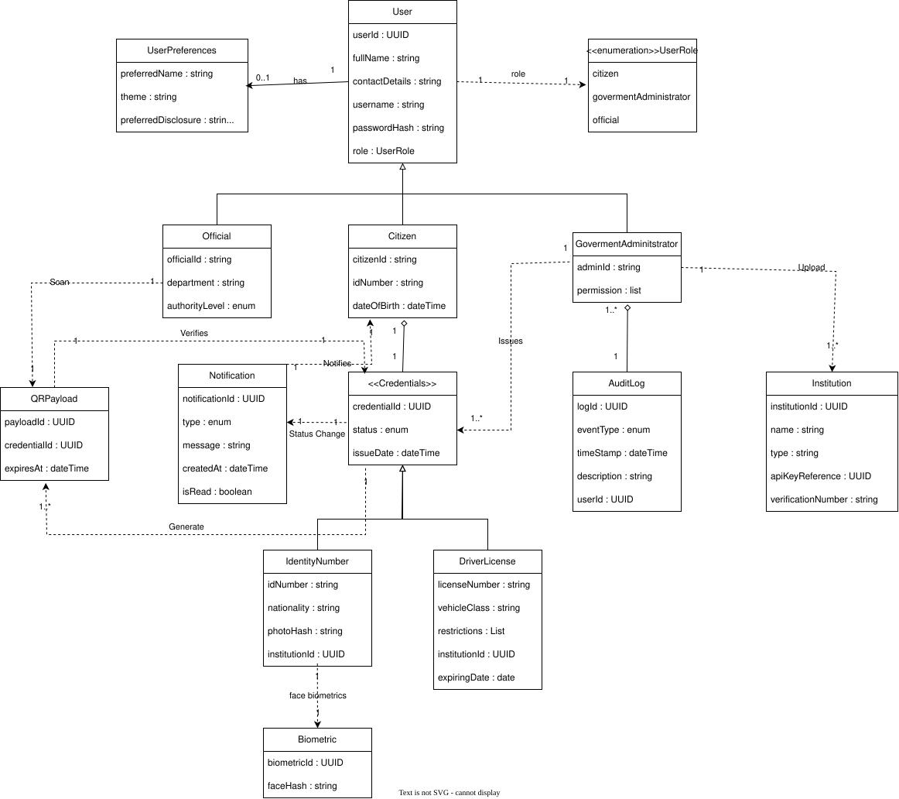

# Software Requirements Specification (SRS)
## FlashID - South African Digital ID Wallet

> COS 301 Capstone Project 2026  
> Team: Tech Titans  
> Client: Agile Bridge (Pty) Ltd  
> Version: 0.1

---

## Table of Contents

1. [Introduction](#1-introduction)
2. [System Overview](#2-system-overview)
3. [User Characteristics, Stories and Actors](#31-user-characteristics-and-actors)
   - [3.1 Actors](#31-user-characteristics-and-actors)
   - [3.2 Epics and User Stories](#32-epics-and-user-stories)
4. [Functional Requirements](#4-functional-requirements)
   - [4.1 Authentication & User Management](#41-authentication-and-user-management-subsystem)
   - [4.2 Credential Management](#42-credential-management-subsystem)
   - [4.3 QR Verification](#43-qr-verification-subsystem)
   - [4.4 Role-Based Access Control](#44-role-based-access-control-subsystem)
   - [4.5 Audit Logging & POPIA Compliance](#45-audit-logging-and-compliance-subsystem)
   - [4.6 Notification](#46-notification-subsystem)
   - [4.7 Analytics & Reporting](#47-analytics-and-reporting-subsystem)
   - [4.8 Institution Registration & API Key Management](#48-institution-registration--api-key-management-subsystem)
   - [4.9 Cryptographic Security & Key Management](#49-cryptographic-security--key-management-subsystem)
   - [4.10 Account Management & Device Security](#410-account-management--device-security-subsystem)
5. [Use Cases](#5-use-cases)
6. [API Service Contracts](#6-api-service-contracts)
7. [Domain Model](#7-domain-model)
8. [Architectural Requirements](#8-architectural-requirements)
9. [Technology Requirements](#9-technology-requirements)
10. [Constraints and Assumptions](#10-constraints-and-assumptions)
11. [Future Enhancements](#11-future-enhancements)

---

## 1. Introduction

### 1.1 Purpose

FlashID is a secure South African Digital Identity Wallet system that enables citizens to digitally store, manage, and present government-issued credentials such as South African IDs and driver's licences.

The system aims to reduce dependency on fragile physical identity documents and replace insecure identity-sharing practices such as sending ID copies over WhatsApp or email.

The solution provides:
- Secure digital identity storage
- Cryptographically signed credentials
- QR-based identity verification
- Role-based administrative management
- Real-time credential validation
- Comprehensive audit logging

The system consists of:
- A citizen mobile wallet application
- A web-based verification portal
- A government administrative dashboard
- An officials administrative dashboard

---

### 1.2 Business Problem

In South Africa, identity verification still heavily depends on physical documentation. Lost, stolen, or forged identity documents create major risks for citizens, government institutions, banks, hospitals, and law enforcement agencies.

FlashID addresses these issues through:
- Digital identity credentials
- Cryptographic verification
- Real-time QR validation
- Secure mobile credential storage
- Controlled identity disclosure

---

### 1.3 Scope

The FlashID prototype will:
- Allow citizens to onboard and access a digital identity wallet
- Allow authorized government administrators to issue credentials
- Allow officials to verify credentials through QR scanning
- Support credential revocation and audit tracking
- Demonstrate secure, scalable identity verification workflows

The prototype will simulate institutional integrations using mock or controlled government services.

---

## 2. System Overview

FlashID is a multi-platform digital identity ecosystem consisting of:

| Platform | Purpose |
|---|---|
| Citizen Mobile App | Stores and presents digital credentials |
| Official Verification Portal | Allows verification of credentials |
| Government Admin Dashboard | Allows credential issuance and management |

The system follows CLEAN Architecture principles to separate:
- Business logic
- Infrastructure concerns
- Presentation logic
- Data persistence

---

# 3. User Characteristics, Stories and Actors

---

## 3.1 User Characteristics and Actors

### 3.1.1 Citizen

A South African citizen who:
- Registers for FlashID
- Stores digital credentials
- Authenticates securely
- Presents credentials using QR codes
- Scan QR codes
- Receives status notifications

---

### 3.1.2 Government Administrator

Authorized personnel who:
- Issue credentials
- Revoke credentials
- Manage citizen onboarding
- View audit logs
- Manage verification workflows

---

### 3.1.3 Official

External authorized entities such as:
- Banks
- Hospitals
- Police officers
- Insurance agencies
- DLTC
- Home Affairs

Officials may:
- Verify credentials
- Receive limited verification data
- Validate authenticity in real time
- Communicate with FlashID to send citizen data to the system

---
## 3.2 Epics and User Stories

The full epics and user stories — including acceptance criteria and definitions of done for all 12 epics and 60+ user stories — are documented in:

 **[epics_and_user_stories.md](./epics_and_user_stories.md)**

### Epic Summary

| Epic | Title |
|---|---|
| E01 | Identity Onboarding & Citizen Registration |
| E02 | Authentication & Role-Based Access Control |
| E03 | Institution Registration & API Key Management |
| E04 | Digital Credential Issuance |
| E05 | Credential Wallet & Viewing |
| E06 | QR Code Generation & Selective Disclosure |
| E07 | Cryptographic Security & Key Management |
| E08 | Credential Verification |
| E09 | Credential Lifecycle Management |
| E10 | Audit Logging & POPIA Compliance |
| E11 | Account Management & Device Security |
| E12 | Advanced Features & Certified Documents |

---

## 4. Functional Requirements

The complete functional requirements — subsystems R1 through R10 — are documented in:

 **[functional_requirements.md](./functional_requirements.md)**

### Subsystem Summary

| Subsystem | Covers |
|---|---|
| 4.1 — R1: Authentication & User Management | Citizen registration, login, gov admin registration, official auth |
| 4.2 — R2: Credential Management | Issuance, revocation, lifecycle, API-based issuance, updates |
| 4.3 — R3: QR Verification | QR generation, one-time use, selective disclosure, additional disclosure |
| 4.4 — R4: Role-Based Access Control | Role separation, admin permissions, emergency responder access |
| 4.5 — R5: Audit Logging & POPIA | Immutable audit trail, POPIA compliance |
| 4.6 — R6: Notifications | Credential and push notification requirements |
| 4.7 — R7: Analytics & Reporting | Verification analytics, admin report export |
| 4.8 — R8: Institution Registration & API Keys | Institution onboarding, API key generation and management |
| 4.9 — R9: Cryptographic Security | Ed25519 signing, key vault, signature verification, key rotation |
| 4.10 — R10: Account Management & Device Security | Password management, device trust, account deletion, duress PIN |

---

## 5. Use Cases

See [use_cases](./use_cases.md) for the Use Cases and their Use Case Diagrams.

---

## 6. API Service Contracts

See [API.md](./API.md) for preliminary API contracts and payloads supporting these use cases.

---
## 7. Domain Model

# 7. Domain Model

---

# 8. Architectural Requirements

See [architecture.md](./architecture.md) for the overarching architectural approach, quality requirements, design patterns, and constraints guiding Demo 1 implementation. 

---

# 9. Technology Requirements

| Category | Technology | Version |
|---|---|---|
| Backend | ASP.NET Core Web API | .NET 10 |
| Web Frontend | Next.js + React | 16.x + 19.x |
| Mobile | React Native + Expo | Latest |
| Relational DB | Azure SQL (SQL Server) | Latest |
| Document DB | Azure Cosmos DB | Latest |
| ORM | Entity Framework Latest |
| Authentication | ASP.NET Identity + JWT Bearer | Latest |
| Frontend State | React Query (@tanstack) | 5.x |
| Styling | Tailwind CSS + shadcn/ui | Latest |
| Testing (Backend) | xUnit v3 | 3.x |
| Testing (Frontend) | Jest + React Testing Library | Latest |
| CI/CD | GitHub Actions | Latest |
| Coverage | Codecov | Latest |

---

## 10. Constraints and Assumptions

### Constraints
- No live government integrations during prototype phase
- POPIA compliance required
- Must support mobile and web platforms
- Must use Azure infrastructure

### Assumptions
- Citizens possess smartphones
- Institutions have internet access
- Mock integrations represent real-world systems

---

## 11. Future Enhancements

Potential future features include:
- Passport credentials
- Vehicle registration credentials
- Offline verification mode
- Blockchain-backed audit trails
- International interoperability
- NFC credential verification
- Selective disclosure verification
- Digital birth certificates