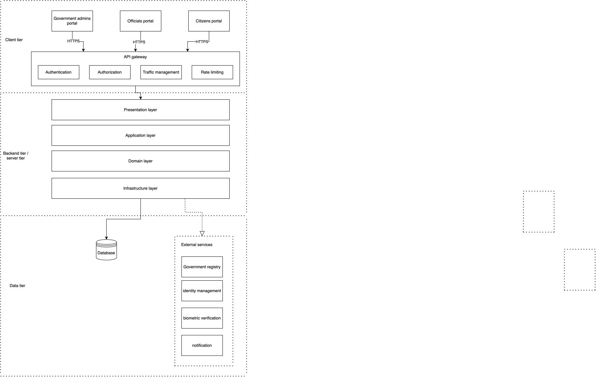

# FlashID — Architectural Requirements
**Tech Titans · COS 301 Capstone 2026**

---

## Overview

FlashID is a multi-platform digital identity ecosystem built on Clean Architecture principles. The system separates business logic, infrastructure concerns, presentation logic, and data persistence into distinct layers, ensuring maintainability, testability, and scalability.

---

## 1. Quality Requirements

### 1.1 Security

- All API endpoints require JWT authentication except public registration and login endpoints
- JWT tokens are issued by the backend, transmitted via HttpOnly cookies, and validated on every request
- All passwords are hashed using BCrypt before storage — plaintext passwords are never persisted
- All data transmitted between client and server uses HTTPS/TLS encryption
- Sensitive citizen data is encrypted at rest in Azure SQL
- QR verification payloads are cryptographically signed using Ed25519 to prevent tampering
- The system enforces account lockout after repeated failed login attempts
- Rate limiting is applied to registration endpoints — 5 requests per minute per client to prevent brute-force attacks (HTTP 429 on breach)
- Role-based access control prevents unauthorized access to restricted endpoints
- The system maintains immutable audit logs for all critical operations

### 1.2 Performance

- API endpoints shall respond within 500ms under normal load
- The system shall support at least 100 concurrent users during the prototype phase
- Database queries are optimized using indexed foreign keys on frequently queried fields
- React Query is used on the frontend to cache server state and minimize redundant API calls

### 1.3 Reliability

- The system handles database connection failures gracefully without exposing raw error messages to clients
- All API responses return structured error messages with appropriate HTTP status codes
- Database migrations are used to ensure consistent schema across all environments
- The seeder ensures consistent test data is available across development environments

### 1.4 Scalability

- The Clean Architecture pattern allows individual layers to be scaled or replaced independently
- Azure SQL is used for relational data with the ability to scale tier as load increases
- Cosmos DB is used for high-volume unstructured data such as audit logs
- The backend API is stateless and supports horizontal scaling

### 1.5 Maintainability

- The system follows Clean Architecture with four layers: Domain, Application, Infrastructure, Presentation
- All backend services are registered using ASP.NET Core Dependency Injection
- Database access is abstracted behind repository interfaces
- All code must pass automated lint, format, and build checks enforced by GitHub Actions CI
- Test coverage is tracked using Codecov on every pull request

### 1.6 Usability

- The web portal is responsive and functions correctly on desktop and tablet screen sizes
- The mobile application follows platform-specific design guidelines
- All forms provide inline validation feedback to users
- The system displays meaningful loading and error states throughout the UI
- Role-based navigation ensures users only see functionality relevant to their role

---

## 2. Architectural Patterns

### 2.1 Clean Architecture

FlashID follows Clean Architecture with four distinct layers:
Presentation (ASP.NET Core Controllers)
↓
Application (Use Cases, DTOs, Validators, Interfaces)
↓
Domain (Entities, Enums, Business Rules)
↑
Infrastructure (EF Core, SQL Server, Service Implementations)

| Layer | Project | Responsibility |
|---|---|---|
| Domain | `Domain.csproj` | Core entities, enums, value objects, and business rules |
| Application | `Application.csproj` | Use case interfaces, DTOs, validators, and typed exceptions |
| Infrastructure | `Infrastructure.csproj` | EF Core DbContext, migrations, service implementations |
| Presentation | `Presentation.csproj` | ASP.NET Core controllers, middleware, JWT config, rate limiting |

Dependencies point inward only — Presentation depends on Application, Application depends on Domain. Infrastructure implements Application interfaces. Business logic is never coupled to framework or database concerns.

### 2.2 Repository Pattern

Database access is abstracted through repository interfaces defined in the Application layer and implemented in the Infrastructure layer using EF Core. This decouples business logic from SQL Server specifics and makes services independently testable.

### 2.3 RESTful API

The backend exposes a RESTful HTTP API:

| Method | Usage |
|---|---|
| GET | Data retrieval |
| POST | Resource creation |
| PUT/PATCH | Updates |
| DELETE | Removal |

All responses follow a consistent JSON structure with appropriate HTTP status codes (200, 201, 400, 401, 403, 404, 409, 429, 500).

### 2.4 Component-Based Frontend Architecture

The frontend follows atomic design with five component levels:

| Level | Examples |
|---|---|
| Atoms | Button, Text, StatusPill, AccountInfoRow |
| Molecules | TextField, Dropdown, AccountCard, ChangePasswordCard |
| Organisms | AppSidebar, RegisterInstitutionForm, LoginForm, ManageUserAccount |
| Templates | AppShell |
| Pages | ViewInstitutionsPage, OnboardCitizenPage, CitizenRegistrationPage |

This ensures reusability, consistency, and separation of UI concerns across the three portals (Citizen, Official, Government Admin).

### 2.5 Context-Based State Management

Global application state such as authenticated user data is managed using React Context. The `UserContext` provides user identity, role, and session information to all components without prop drilling. User state is persisted to `localStorage` so sessions survive page refreshes.

### 2.6 Server State Management

React Query (`@tanstack/react-query`) manages all server state on the frontend. Components subscribe to query keys and automatically re-render when data changes. Mutations trigger optimistic updates and toast notifications on success or failure.

---

## 3. Design Patterns

### 3.1 Dependency Injection
All services and repositories are registered through ASP.NET Core's built-in DI container in `DependencyInjection.cs`. This promotes loose coupling and makes unit testing straightforward through interface mocking.

### 3.2 Data Transfer Object (DTO)
DTOs decouple internal domain entities from API request and response shapes. Separate request and response DTOs are defined for each use case, preventing over-posting and controlling data exposure.
RegisterInstitutionRequestDto  →  InstitutionService  →  RegisterInstitutionResponseDto

### 3.3 Validator Pattern
Input validation is centralized in static validator classes in the Application layer:
- `InstitutionValidator` — validates institution registration requests
- `CitizenRegistrationValidator` — validates citizen registration requests

Validators throw typed domain exceptions that are caught and mapped to HTTP error responses by the controller layer.

### 3.4 Service Pattern
Business logic is encapsulated in service classes implementing interfaces defined in the Application layer:
- `IInstitutionService` → `InstitutionService`
- `ICitizenService` → `CitizenService`
- `IAuthService` → `AuthService`
- `IOnboardingService` → `OnboardingService`

Controllers delegate all business operations to services, keeping controllers thin and focused on HTTP concerns only.

### 3.5 Observer Pattern (React Query)
The frontend uses React Query to manage server state reactively. Components subscribe to query keys and automatically re-render when underlying data changes, following the observer pattern for reactive UI updates without manual state synchronization.

### 3.6 Factory Pattern (API Key Generation)
Institution API keys are generated using a static factory method `GenerateApiKey()` inside `InstitutionService`. This centralizes key generation logic and ensures a consistent `flashid_live_{hex}` format across the system.

### 3.7 Mock Service Pattern
During the prototype phase, external government registry integrations are simulated using mock service implementations (e.g., `MockGovernmentRegistryService`). These implement the same interfaces as real services and can be swapped out when real integrations become available, following the Strategy pattern.

---

## 4. Architectural Constraints

| Constraint | Detail |
|---|---|
| Cloud Infrastructure | Must use Azure for hosting, database, and storage services |
| Backend Framework | Must use ASP.NET Core (.NET 10) |
| Web Frontend | Must use Next.js 16 with React 19 |
| Mobile Application | Must use React Native with Expo |
| Authentication | Must use JWT tokens issued by the backend, transmitted via HttpOnly cookies |
| Government Integrations | No live government API integrations permitted during prototype phase — mock services only |
| Data Protection | POPIA compliance must be considered in all citizen data handling decisions |
| CI/CD | Must use GitHub Actions for pipeline automation |
| Code Quality | All PRs must pass automated build, lint, format, and test checks before merging |
| Version Control | All contributions must be tracked via Git with meaningful commit messages |

---
