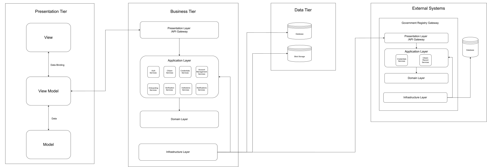
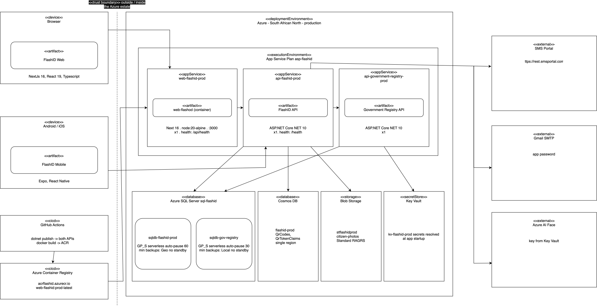
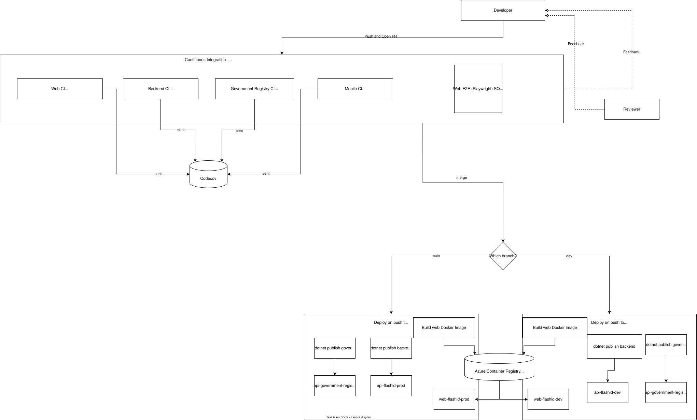

# Software Architecture Specification (SAS)
## FlashID - South African Digital ID Wallet

> COS 301 Capstone Project 2026  
> Team: Tech Titans  
> Client: Agile Bridge (Pty) Ltd  
> Version: 0.1

## Table of Contents

1. [Introduction](#1-introduction)
2. [Architectural Requirements](#2-architectural-requirements)
    - [2.1 Architectural Patterns](#21-architectural-patterns)
    - [2.2 Design Patterns](#22-design-patterns)
    - [2.3 Constraints](#23-constraints)
    - [2.4 Architectural Diagram](#24-architectural-diagram)
    - [2.5 Mapping Quality Requirements to Architectural Decisions](#25-mapping-quality-requirements-to-architechtural-decisions)
3. [Technology Requirements](#3-technology-requirements)
4. [API Contracts](#4-api-contracts)
    - [Auth](#auth)
    - [Citizens](#citizens)
    - [Credentials](#credentials)
    - [Credential Activation](#credential-activation)
    - [Citizen Verify](#citizen-verify)
    - [Institutions](#institutions)
    - [Onboarding](#onboarding)
    - [Activity](#activity)
    - [Dashboard](#dashboard)
    - [Account Management](#account-management)
    - [Notifications](#notifications)
    - [Officials](#officials)
    - [Trusted Devices](#trusted-devices)
    - [Government Registry Service](#government-registry-service)
5. [Deployment](#5-deployment)
    - [5.1 Live System](#51-live-system)
    - [5.2 Environment Parity](#52-environment-parity)
    - [5.3 Infrastructure as Code / Containerisation](#53-infrastructure-as-code--containerisation)
    - [5.4 Secrets Management](#54-secrets-management)
    - [5.5 Rollback Strategy](#55-rollback-strategy)
    - [5.6 Deployment Diagram](#56-deployment-diagram)
    - [5.7 CI/CD Pipeline Diagram](#57-cicd-pipeline-diagram)

## 1. Introduction

This Software Architecture Specification (SAS) describes the technical structure of FlashID (South African Digital ID Wallet). The architectural decisions made to satisfy the requirements defined in the SRS. The SRS specifies *what* the system must do, where as this document *how* the system is built, deployed and operated to meet those requirements.

FlashID is composed of four subsystems: Next.js for web portal for citizens, administrators and officials. React Native for mobile app wallet for citizens and ASP.NET Core for backend API that owns identity, credential, authentication logic and a separate government-registry service that simulates the external national ID authority from Home Affairs that FlashID integrates against. All components are containerised or published via GitHub Actions and deployed to Azure Web Apps, with SQL Server for persistence and Azure Blob Storage for credential photo storage.

## 2. Architectural Requirements

The full architectural requirements, including architectural patterns, design patterns, constraints and mapping can be found in:

 **[architecture-v2.md](../demo3/architecture-v3.md)**

### Architectural Diagram

  

## 3. Technology Requirements
| Area | Framework | Why
|---|---|---|
| Web Frontend | Next.js 16, React 19, Typescript | Type-safe, React is server-rendered for admin portal |
| Web UI | Tailwind CSS, Radix UI and shadcn/ui | Accessible, Better Readability, Reuable components without rebuilding from scratch |
| Mobile | Expo React Native | Single codebase for IOS and Android mobile app |
| Client data | TanStack Query, Zustand | Server-state caching and lightweight local UI state |
| Backend API | ASP.NET Core - .NET 10 - C# | Strongly-types, high-performance API layer |
| Authentication | JWT via HttpOnly cookies | Stateless auth by using tokens which are hidden and reduce XSS risk |
| Database | Microsoft SQL Server | Relational integrity for identity and credential records |
| File storage | Azure Blob Storage | Stores citizen photos separately from relational data |
| CI/CD and Hosting | Github Actions, Docker, Azure Web Apps | Automated build/test/deploy on every push |
| Code quality | ESLint, Prettier, SonarCloud, Codecov | Enforces consistent style and catches issues before merge |

## 4. API Contracts
> Base URL: `http://localhost:5118` (DEV)
> All endpoints return JSON. All protected endpoints require a valid JWT token transmitted via HttpOnly cookie.

### Auth

#### GET /api/auth/me
Return the currently authenticated user's profile

**Authentication:** Required

**Response 200:**
```json
{
    "id": "string",
    "names": "string",
    "surname": "string",
    "email": "string",
    "role": "string"
}
```

#### POST /api/auth/login
Authenticates a user and sets a JWT token in an HttpOnly cookie.

**Authentication:** None

**Request Body:**
```json
{
    "email": "string",
    "password": "string"
}
```

**Response 200:** JWT token set in HttpOnly cookie, user profile returned
**Response 401:** Invalid credentials
**Reponse 423:** Account locked out

#### Post /api/auth/logout
Clears the JWT cookie and ends the user session.

**Authentication:** Required

**Response 200:** Session ended, cookie cleared

### Citizens

#### POST /api/citizens/register
Registers a new citizen account using a SA ID number and activation code.

**Authentication:** None
**Rate Limit:** 5 requests per minute per client

**Request Body:**
```json
{
    "saId": "string",
    "username": "string",
    "password": "string",
    "activationCode": "string"
}
```

**Validation Rules:**
- `saId` - exact 13 num digits
- `username` - min 8 char, no spaces
- `password` - min 10 char, must have uppercase, lowercase, digit and special char
- `activationCode` - non-empty

**Response 201:** Citizen acc created
**Response 400:** Validation error
**Response 409:** Email already taken
**Response 429:** Rate limit exceeded

#### POST /api/citizen/verify-email
Verifies a citizen's email using OTP sent at registeration.

**Authentication:** None

**Request Body:**
```json
{
    "email": "string",
    "otp": "string"
}
```

**Response 200:** Email verified
**Response 400:** Invalid OTP, expired OTP, too many attempts, or already verified

#### POST /api/citizens/resend-otp
Resends the email verification OTP.

**Authentication:** None

**Response 200:** OTP resent
**Response 400:** Already verified or invalid request

### Credentials 

#### GET /api/credentials/me
Returns authenticated citizen's full creds set.

**Authentication:** Required for Citizen

#### GET /api/credentials/mine
Returns cred summary for QR.

**Authentication:** Required

#### POST /api/credentials/{credentialId}/qr-token
Generate the time-limited QR for scan creds.

**Authentication:** Required

**Path Parameter:** `credentialId` - UUID

**Request Body:**
```json
{
    "disclosedFields": ["string"]
}
```

**Response 200:** QR token issued
**Response 400:** Credential not active or invalid
**Response 403:** Access denied
**Response 404:** Credential not found

#### POST /api/credentials/resolve
Resolves a scanned QR token into disclosed credential data.

**Authentication:** Required

**Request Body:** 
```json
{ "token": "string" }
```

**Response 200:** Disclosed credential data
**Response 400:** Invalid or expired disclosure token

### Credential Activation

#### POST /api/activate-credentials
Activates a citizen's credentials after register.

**Authentication:** Required for Citizen

**Response 200:** Credentials activated
**Response 401:** Account could not be identified from token

### Credential Expiry Check

#### POST /api/credentials/expiry-check
Manually runs the daily credential-expiry check. Idempotent per SAST calendar date (If today's check already completed, returns that result without reprocessing. If another instance is currently running today's check, returns `409`.)

**Authentication:** Required for Government Administrator

**Request Body:** None

**Response 200:**
```json
{
    "runDate": "date",
    "status": "string",
    "processedCount": 0,
    "startedAt": "date",
    "completedAt": "date",
    "errorMessage": "string"
}
```

**Response 403:** Caller is not a Government Administrator
**Response 409:** Another expiry check is currently running for today

### Citizen Verify

#### POST /api/citizen-verification/activate-token
Verifies a citizen's activation token as part of the credential-activation flow.

**Authentication:** Required for Citizen

### Institutions

#### POST /api/institutions/register
Registers a new institution and returns a one-time API key.

**Authentication:** Required for Gov Admin

**Request Body:**
```json
{
    "name": "string",
    "type": 0,
    "verificationNumber": "string",
    "adminId": "string",
}
```

**Institution Types:**
| Value | Type |
|---|---|
| 0 | HomeAffairs |
| 1 | LicensingDepartment |

**Validation Rules:**
- `name` - required
- `verificationNumber` - required
- `adminId` - non-empty

**Response 200:**
```json
{
    "institutionId": "string",
    "name": "string",
    "type": "string",
    "apiKey": "string",
    "apiKeyReference": "string",
    "verificationNumber": "string",
    "createdAt": "date"
}
```

**Response 400:** Validation error
**Response 404:** Admin not found
**Response 409:** Verification number already exists

#### GET /api/institutions
Returns all registered institutions.

**Authentication:** Required for Gov Admin

**Response 200:**
```json
[
    {
        "institutionId": "string",
        "name": "string",
        "type": "string",
        "verificationNumber": "string",
        "registeredById": "string",
        "createdAt": "date"
    }
]
```

#### GET /api/institutions/{institutionId}
Returns single institution by ID.

**Authentication:** Required

**Path Parameter:**
- `institutionId` - UUID of the institution

**Response 200:** Institution object
**Response 404:** Institution not found

### Onboarding

#### GET /api/onboarding/verify/{idNumber}
Looks up a citizen's identity record from the mock gov register.

**Authentication:** Required for Officials

**Path Parameter:**
- `idNumber` - SA ID number

**Response 200:**
```json
{
    "saId": "string",
    "names": "string",
    "surname": "string",
    "dateOfBirth": "string",
    "gender": "string"
}
```

**Response 404:** Identity record not found

#### POST /api/onboarding/citizen
Onboards a citizen after identity verification and generate an activation code.

**Authentication:** Required for Officials

**Request Body:**
```json
{
    "saId" : "string",
    "phoneNumber": "string",
    "email": "string",
    "consentGiven": true
}
```

**Response 200:**
```json
{
    "activationCode": "string",
    "citizenId" : "string",
    "message" : "string"
}
```

**Response 400:** Validation error or consent not given
**Response 409:** Citizen already onboarded

### Issue Credentials

#### GET /api/credentials/citizens/{saId}/status
Looks up a citizen already known to FlashID (via SA ID) and returns their onboarding status and any credentials already issued, so the admin portal can decide whether to enable "Issue Driver's License" or route to onboarding.

**Authentication:** Required for Officials

**Path Parameter:**
- `saId` - SA ID number, 13 digits

**Response 200:**
```json
{
    "saId": "string",
    "names": "string",
    "surname": "string",
    "dateOfBirth": "date",
    "status": "string",
    "activatedAt": "date",
    "phoneNumber": "string",
    "email": "string",
    "existingCredentials": [
        { 
            "type": "string",
            "status": "string",
            "issueDate": "date"
        }
    ]
}
```

Citizen Status Values: Pending | Activated | Deactivated | Suspended | Verified
Credential Status Values (existingCredentials[].status): Active | Inactive | Investigation | Revoked | Expired

`phoneNumber` and `email` are null unless status is Activated. They belong to the citizen's FlashID user account, which only exists after activation.

**Response 400:** Invalid SA ID format
**Response 404:** No FlashID citizen record found for this SA ID. Official should route to onboarding

#### POST /api/credentials/issue
Fetches a citizen's credential from the government registry and issue it into FlashID, after recording POPIA consent for this specific issuance.

**Authentication:** Required for Officials

**Request Body:**
```json
{
    "saId": "string",
    "credentialType": "string",
    "consentGiven": true
}
```

**Credential Types:**
| Value | Type |
|---|---|
| IdentityDocument | Identity document |
| DriversLicense | Driver's license |

**Response 201:**
```json
{
    "id": "string",
    "type": "string",
    "title": "string",
    "issuedBy": "string",
    "status": "string",
    "issueDate": "date",
    "driversLicense": {
            "licenseNumber": "string",
            "licenseCode": "string",
            "restrictions": "string",
            "expiryDate": "date"
    }
}
```

`issuedBy` is the government issuing authority (e.g. "Licensing Department"), taken from the government registry record, not the FlashID official who performed the action. `driversLicense` is present when `credentialType` is "DriversLicense". An equivalent `identityDocument` object is present when `credentialType` is "IdentityDocument".

**Response 400:** Validation error, or consent not given
**Response 404:** Citizen not found in FlashID, or no matching record at the government registry
**Response 409:** Citizen is not `Activated` in FlashID, or already has an `Active` credential of that type

### Activity

#### GET api/activity/me
Returns the authenticated citizen's activity history

**Authentication:** Required for Citizen

### Dashboard

#### GET /api/dashboard-account-card/me
Returns summary account data shown on the citizen's dashboard card.

**Authentication:** Required for Citizen

**Response 200:** Account Summary
**Response 404:** No account found

### Account Management

#### DELETE /api/account

**Authentication:** Required

**Response 204:** Account deleted
**Response 401:** Unauthenticated

#### GET /api/manage-user-account/me
Returns the authenticated user's acc details.

**Authentication:** Required

#### POST /api/manage-user-account/email/verify-password
Verify the user current password before allowing them to update email.

**Authentication:** Required
**Rate Limit:** YES

**Request Body:** 
```json
{
    "password": "string"
}
```

**Response 200:** Password verified
**Response 422:** Incorrect Password
**Response 423:** Account locked

#### POST /api/manage-user-account/email/request-change
Request change of account email address and send OTP to new address.

**Authentication:** Required
**Rate Limit:** YES

**Request Body:**
```json
{
    "newEmail": "string"
}
```

**Response 200:** Verification code sent
**Response 400:** Invalid email
**Response 403:** Re-authentication required
**Response 409:** New email already taken

#### POST /api/manage-user-account/email/resend-otp
Resends the OTP for pending email change.

**Authentication:** Required
**Rate Limit:** YES

**Response 200:** OTP resent
**Response 400:** No pending email change

#### POST /api/manage-user-account/email/confirm
Confirms the pending email change using the OTP.

**Authentication:** Required

**Request Body:**
```json
{
    "otp": "string"
}
```

**Response 200:** Email updated
**Response 400:** No pending change, OTP expired, too many attempts, invalid OTP
**Response 409:** New email taken

#### PUT /api/UpdatePassword
Updates the authenticated user's password

**Authentication:** Required

**Response 200:** Password updated
**Response 400:** Update failed

### Notifications

#### GET /api/notifications/me
Returns the authenticated citizen's notifications.

**Authentication:** Required for Citizen

### Officials

#### POST /api/officials/badge-token
Generate a badge token for an authenticated official

**Authentication:** Required for Officials

**Response 200:** Badge token issued
**Response 404:** Officials not found

#### POST /api/officials/verify-badge
Verifies an official's badge token.

**Authentication:** None

**Request Body:**
```json
{
    { "token": "string" }
}
```

**Response 200:** Badge verified
**Response 400:** Invalid badge token

### Trusted Devices

#### GET /api/trusted-devices/me
Returns the citizen's list of trusted devices.

**Authentication:** Required for Citizen

#### DELETE /api/trusted-devices/{deviceId}
Unlinks a trusted device from the citizen's account.

**Authentication:** Required for Citizen

**Path Parameter:** `deviceId` - UUID

**Response 204:** Device unlink
**Response 404:** Device not found

### Government Registry Service

#### GET /api/citizens/{saId}
Looks up a citizen's gov-held Id record by SA ID number

**Path Parameter:** `saId` - SA ID number

**Response 200:** Citizen record
**Response 404:** Not found

#### GET /api/credentials/{saId}/identity-document
Returns the gov-held ID doc record for a citizen.

**Response 200:** ID doc data
**Response 404:** Not found

#### GET /api/credentials/{saId}/drivers-license
Return gov-held driver license record for citizen.

**Response 200:** Driver's license data
**Response 404:** Not found

## 5. Deployment

### 5.1 Live System

| Environment | Service | URL |
|---|---|---|
| Production | WEB | https://web-flashid-prod-cycxaycqetbcdshk.southafricanorth-01.azurewebsites.net |
| Production | Backend API | https://api-flashid-prod-behwhegmcshsb6dg.southafricanorth-01.azurewebsites.net |
| Production | Government Registry API | https://api-government-registry-prod-ajavcaate3e5fecb.southafricanorth-01.azurewebsites.net |
| Development | WEB | https://web-flashid-dev-c5f2gbd8hbcqf8h2.southafricanorth-01.azurewebsites.net |
| Development | Backend API | https://api-flashid-dev-bjgng2dxd6hrgbca.southafricanorth-01.azurewebsites.net |
| Development | Government Registry API | https://api-government-registry-dev-g4hsdee5cre9ghcx.southafricanorth-01.azurewebsites.net |

### 5.2 Environment Parity

FlashID distinguishes two environments: **development** and **production**. Both are deployed automatically via GitHub Actions. For now there is no staging environment due to budget issues.

| | Development | Production |
|---|---|---|
| Trigger branch | `dev` | `main` |
| Web | web-flashid-dev | web-flashid-prod |
| Backend API | api-flashid-dev | api-flashid-prod |
| Government Registry | api-government-registry-dev | api-government-registry-prod |
| Purpose | Integration testing of merged features before release | Demo, Stable Release |

All three services deploy automatically on push to their respective branches. There is no manual deployment step for now. Local development is a third, non-deployable environment. Developers will run the stack `pnpm dev` on web, backend and government-registry concurrently. This is with a local SQL Server instance.

### 5.3 Infrastructure as Code / Containerisation
FlashID uses Docker containerisation to provide reproducible deployment of the web application and backend services.

Each deployable service contains a Dockerfile that defines its runtime environment, dependency installation, build process, exposed port, and startup command.

GitHub Actions builds the relevant service container when changes are pushed to the configured branch. The resulting container image is published to the configured container registry and deployed to the corresponding Azure App Service.

Containerisation ensures that the same application artefact tested in the CI pipeline is deployed to Azure, reducing differences between developer machines and cloud-hosted environments.
### 5.4 Secrets Management
Secrets and environment-specific configuration are not committed to the Git repository.

In deployed environments, sensitive configuration values are stored using Azure App Service environment variables and connection string settings. These values include:

- SQL Server connection strings
- JWT signing configuration
- Government Registry API keys
- Government Registry service URLs
- Azure Blob Storage credentials
- Email provider credentials

Local development uses `.NET User Secrets`, local environment variables, and development configuration files that are excluded from source control.

Public configuration templates may be included in the repository to document the required variable names, but these templates do not contain real secret values.

Application code accesses configuration through ASP.NET Core configuration providers and environment variables. Secret va
### 5.5 Rollback Strategy
FlashID uses a previous-version redeployment strategy for rollback.

Each successful CI/CD run produces a deployment artefact or container image associated with a specific Git commit. If a newly deployed version fails, the team identifies the most recent known-good deployment and redeploys that version to the affected Azure App Service.

Where a failure is caused by application code, the responsible commit may also be reverted through a new pull request. Force-pushing or resetting the shared `main` or `dev` branches is not used.
### 5.6 Deployment Diagram

### 5.7 CI/CD Pipeline Diagram

