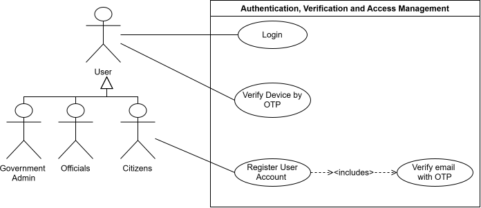
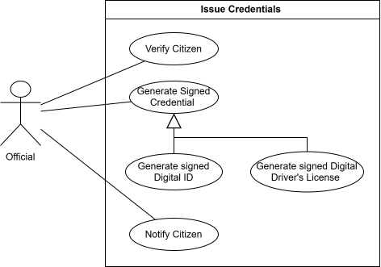
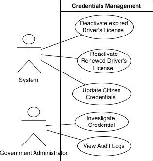

# SA Digital ID Wallet — Use Case Overview  
**Tech Titans · COS 301 Capstone 2026**

# Use Cases

The following use case diagrams represent the core FlashID workflows develpoed. These diagrams show the main system actors, system boundaries, and user-facing functions currently being implemented or demonstrated.

---
## 1. Authentication, Verification and Access Management

The Authentication, Verification and Access Management subsystem allows users to securely register, authenticate and verify their identity before accessing FlashID. The subsystem also provides additional device verification when a user attempts to access their account from an untrusted device.

### Register User Account

**TUCBW:** This use case begins when a Citizen chooses to register a FlashID account after being onboarded and provides the required registration information.

**TUCEW:** This use case ends when the Citizen's account has been successfully created and the email verification process has been initiated.

### Verify Email with OTP

**TUCBW:** This use case begins when a registered Citizen submits the OTP sent to their registered email address.

**TUCEW:** This use case ends when the OTP has been successfully validated and the Citizen's email address is marked as verified.

### Login

**TUCBW:** This use case begins when a User submits their FlashID login credentials.

**TUCEW:** This use case ends when the User's credentials have been successfully authenticated and either access is granted for a trusted device or device verification is required for an untrusted device.

### Verify Device by OTP

**TUCBW:** This use case begins when a User attempting to log in from an untrusted device submits the device verification OTP sent to their registered email address.

**TUCEW:** This use case ends when the OTP has been successfully validated, the device has been recorded as trusted, and the User's authenticated session is established.

### POPIA Compliance
- **Section 8 — Accountability:** FlashID must ensure that authentication, email verification, and device verification processes comply with POPIA and that access to user accounts is appropriately controlled.

- **Section 10 — Minimality:** Only personal information necessary to authenticate users, verify email addresses, and identify trusted devices may be collected and processed.

- **Section 13 — Purpose Specification:** User credentials, OTPs, device information, IP addresses, and approximate location data may only be processed for authentication, verification, account security, and trusted-device management.

- **Section 14 — Retention and Restriction of Records:** Authentication and verification information must not be retained for longer than necessary. Temporary information such as OTPs must expire after the defined verification period.

- **Section 15 — Further Processing Limitation:** Authentication, device, IP address, and location information must not be reused for purposes incompatible with the security and verification purposes for which it was collected.

- **Section 18 — Notification to Data Subject:** Users must be informed of the personal information collected during registration and authentication, including device and approximate location information where applicable, and the purpose for which it is processed.

- **Sections 19–22 — Security Safeguards:** Passwords, OTPs, authentication tokens, and trusted-device tokens must be appropriately protected. FlashID must implement safeguards such as password hashing, expiring OTPs, secure HttpOnly cookies, access control, and authentication audit logging.

---
## 2. Upload an Institution

The Upload an Institution subsystem allows a government administrator to upload institution data, verify the institution, generate an institution API key, and view the API key after registration.

### POPIA Compliance

- **Section 8 — Accountability:** Only authorised government administrators may register and verify institutions.
- **Section 13 — Purpose Specification:** Institution data and API keys are used only for authorised FlashID integration.
- **Section 15 — Further Processing Limitation:** API keys must only be used for approved communication between FlashID and registered institutions.
- **Sections 19–22 — Security Safeguards:** API keys must be securely generated, stored, displayed, and managed.

---
## 3. Onboard Citizen

The Onboard Citizen subsystem allows a Home Affairs official to retrieve a citizen identity record, capture citizen consent, capture contact details, register a pending FlashID account, and send an activation code.

### POPIA Compliance

- **Section 8 — Accountability:** The official’s onboarding actions will be logged.
- **Section 10 — Minimality:** Only necessary identity and contact details is be captured.
- **Section 11 — Consent:** Explicit citizen consent must be captured before onboarding.
- **Section 12 — Collection Directly from Data Subject:** Contact details and consent are collected directly from the citizen.
- **Section 13 — Purpose Specification:** Citizen data is used for FlashID onboarding.
- **Sections 17–18 — Openness:** Citizens are to be informed about how their data will be used.
- **Sections 19–22 — Security Safeguards:** Identity records, activation codes, and contact details must be securely processed.

---
## 4. Citizen Registration

The Citizen Registration subsystem allows citizens to register for a FlashID account. Registration may occur using an activation code or through physical ID verification.

### POPIA Compliance

- **Section 10 — Minimality:** Registration should only collect the information required to create and verify the account.
- **Section 11 — Consent:** Citizens voluntarily register and activate their FlashID account.
- **Section 12 — Collection Directly from Data Subject:** Registration information is collected directly from the citizen where possible.
- **Section 13 — Purpose Specification:** Registration data is used to create and activate the FlashID account.
- **Section 19 — Security Safeguards:** Activation codes, passwords, and identity verification steps must be securely handled.

---
## 5. Issue Credentials

The Issue Credentials subsystem allows authorised officials to verify a citizen and issue signed digital credentials. The system supports generating signed digital IDs and signed digital driver’s licences, then notifying the citizen once the credential has been issued.

### POPIA Compliance

- **Section 10 — Minimality:** Only the data required to issue the credential should be processed.
- **Section 11 — Consent:** Credential issuing should occur after the citizen has been onboarded and consent has been captured.
- **Section 13 — Purpose Specification:** Citizen data is processed only for credential issuing.
- **Section 16 — Information Quality:** Credentials should be generated from verified citizen records.
- **Sections 19–22 — Security Safeguards:** Credentials must be digitally signed and protected from tampering.

---
## 6. Access Credentials

The Access Credentials subsystem allows citizens to log in, view their credentials, generate certified copies, generate QR codes, scan QR codes, and control selective disclosure preferences.

### POPIA Compliance

- **Section 10 — Minimality:** QR codes and selective disclosure should expose only the minimum required information.
- **Section 11 — Consent:** Citizens choose when to generate QR codes, certified copies, and disclosure preferences.
- **Section 13 — Purpose Specification:** Credential information is shared only for verification or certified copy purposes.
- **Section 19 — Security Safeguards:** Access to credentials must be protected through authentication and secure QR generation.
- **Section 23 — Access to Personal Information:** Citizens can view and access their own credential information.

---
## 7. Account Management

The Account Management subsystem allows citizens to maintain their FlashID account details and security settings. This includes changing passwords, updating usernames, updating contact details, and managing trusted devices.

### POPIA Compliance

- **Section 8 — Accountability:** Account changes must be logged and traceable.
- **Section 10 — Minimality:** Only required account and contact information should be collected or updated.
- **Section 11 — Consent:** Citizens voluntarily initiate updates to their own account information.
- **Section 19 — Security Safeguards:** Password changes and trusted device management protect citizen data from unauthorised access.
- **Section 23 — Access to Personal Information:** Citizens are able to access and manage their own personal account information.

---
## 8. Credentials Management

The Credentials Management subsystem allows the system and government administrators to manage the lifecycle of citizen credentials. This includes expiring driver’s licences, reactivating renewed licences, updating citizen credentials, investigating credentials, and viewing audit logs.

### POPIA Compliance

- **Section 8 — Accountability:** Administrative actions must be audit logged.
- **Section 15 — Further Processing Limitation:** Credential data must only be used for valid legal, administrative, or verification purposes.
- **Section 16 — Information Quality:** Credential records must remain accurate, current, and updated when authoritative source data changes.
- **Sections 19–22 — Security Safeguards:** Only authorised administrators may update, investigate, or reactivate credentials.

---