# SA Digital ID Wallet: Use Case Overview
**Tech Titans · COS 301 Capstone 2026**

# Use Cases

The following use case diagrams represent the core FlashID workflows developed. These diagrams show the main system actors, system boundaries, and user-facing functions implemented for Demo 4.

---
## 1. Authentication, Verification and Access Management

The Authentication, Verification and Access Management subsystem allows users to securely register, authenticate and verify their identity before accessing FlashID. The subsystem also provides additional device verification when a user attempts to access their account from an untrusted device.

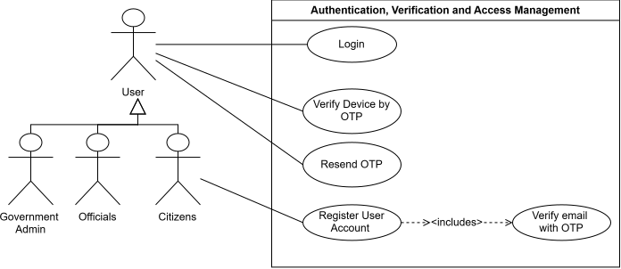

### Register User Account

**TUCBW:** This use case begins when a Citizen chooses to create a FlashID account and provides an email address and password.

**TUCEW:** This use case ends when the Citizen's account has been successfully created and a verification OTP has been sent to their email address.

### Verify Email with OTP

**TUCBW:** This use case begins when a registered Citizen submits the OTP sent to their registered email address.

**TUCEW:** This use case ends when the OTP has been successfully validated and the Citizen's email address is marked as verified.

### Login

**TUCBW:** This use case begins when a User submits their FlashID login credentials.

**TUCEW:** This use case ends when the User's credentials have been successfully authenticated and either access is granted for a trusted device or device verification is required for an untrusted device, or when the account is locked for 30 minutes after 5 failed attempts.

### Verify Device by OTP

**TUCBW:** This use case begins when a User attempting to log in from an untrusted device submits the device verification OTP sent to their registered email address.

**TUCEW:** This use case ends when the OTP has been successfully validated, the device has been recorded as trusted, and the User's authenticated session is established.

### Resend OTP

**TUCBW:** This use case begins when a User requests a new OTP after the original code has not been received or can no longer be used.

**TUCEW:** This use case ends when a new OTP has been generated, the verification expiry period has been refreshed, and the new OTP has been sent to the User's registered email address.

### POPIA Compliance
- **Section 8 - Accountability:** FlashID must ensure that authentication, email verification, and device verification processes comply with POPIA and that access to user accounts is appropriately controlled.

- **Section 10 - Minimality:** Only personal information necessary to authenticate users, verify email addresses, and identify trusted devices may be collected and processed.

- **Section 13 - Purpose Specification:** User credentials, OTPs, device information, IP addresses, and approximate location data may only be processed for authentication, verification, account security, and trusted-device management.

- **Section 14 - Retention and Restriction of Records:** Authentication and verification information must not be retained for longer than necessary. Temporary information such as OTPs must expire after the defined verification period.

- **Section 15 - Further Processing Limitation:** Authentication, device, IP address, and location information must not be reused for purposes incompatible with the security and verification purposes for which it was collected.

- **Section 18 - Notification to Data Subject:** Users must be informed of the personal information collected during registration and authentication, including device and approximate location information where applicable, and the purpose for which it is processed.

- **Sections 19-22 - Security Safeguards:** Passwords, OTPs, authentication tokens, and trusted-device tokens must be appropriately protected. FlashID implements safeguards such as password hashing, expiring OTPs, secure HttpOnly cookies on the web, secure token storage on mobile, access control, and authentication audit logging.

---
## 2. Upload an Institution

The Upload an Institution subsystem allows a government administrator to enter institution details, have them validated, generate an institution API key, and view the API key once after registration.

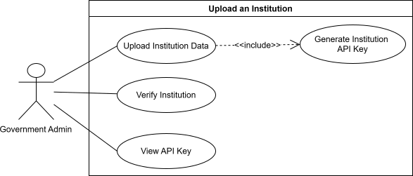

### POPIA Compliance

- **Section 8 - Accountability:** Only authorised government administrators may register institutions, and every registration is audit logged.
- **Section 13 - Purpose Specification:** Institution data and API keys are used only for authorised FlashID integration.
- **Section 15 - Further Processing Limitation:** API keys must only be used for approved communication between FlashID and registered institutions.
- **Sections 19-22 - Security Safeguards:** API keys are randomly generated, shown only once, and never stored in plaintext.

---
## 3. Onboard Citizen

The Onboard Citizen subsystem allows a Home Affairs official to retrieve a citizen identity record, capture citizen consent, capture contact details, register a pending FlashID record, email the citizen an activation link and receive a 6-digit activation PIN to give to the citizen.

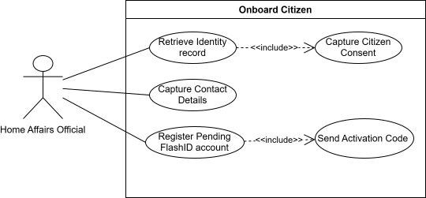

### POPIA Compliance

- **Section 8 - Accountability:** The official's onboarding actions are logged.
- **Section 10 - Minimality:** Only necessary identity and contact details are captured.
- **Section 11 - Consent:** Explicit citizen consent must be captured before onboarding.
- **Section 12 - Collection Directly from Data Subject:** Contact details and consent are collected directly from the citizen.
- **Section 13 - Purpose Specification:** Citizen data is used for FlashID onboarding.
- **Sections 17-18 - Openness:** Citizens are to be informed about how their data will be used.
- **Sections 19-22 - Security Safeguards:** Identity records, activation links, activation PINs and contact details must be securely processed; only hashes of the activation token and PIN are stored.

---
## 4. Citizen Registration

The Citizen Registration subsystem allows a citizen with a FlashID account to link it to their identity. Linking may occur using the activation link and PIN from onboarding, or through physical ID verification with an Azure Face liveness check matched against the government registry portrait. Once linked, the citizen can add their existing credentials from the government registry.

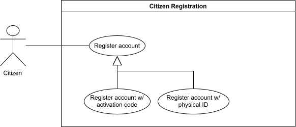

### POPIA Compliance

- **Section 10 - Minimality:** Registration should only collect the information required to create and verify the account.
- **Section 11 - Consent:** Citizens voluntarily register, and must give explicit consent before any biometric processing in physical ID verification.
- **Section 12 - Collection Directly from Data Subject:** Registration information is collected directly from the citizen where possible.
- **Section 13 - Purpose Specification:** Registration data is used to create and activate the FlashID account.
- **Section 19 - Security Safeguards:** Activation codes, passwords, and identity verification steps must be securely handled.

---
## 5. Issue Credentials

The Issue Credentials subsystem allows authorised officials to look up a citizen and issue digital credentials sourced from the government registry. The system supports issuing digital IDs and digital driver's licences, then notifying the citizen once the credential has been issued.

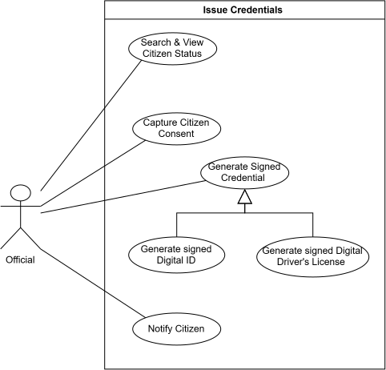

### Search & View Citizen Status

**TUCBW:** This use case begins with an Official entering a citizen's SA ID number into the officials portal to look them up.

**TUCEW:** This use case ends with the citizen's FlashID status, profile details, and any existing credentials being displayed to the Official, or an error if no matching citizen is found. The lookup is recorded in the audit log.

---

### Capture Citizen Consent

**TUCBW:** This use case begins with an Official confirming the citizen is Activated in FlashID and selecting a credential type to issue to the citizen.

**TUCEW:** This use case ends with the Official confirming POPIA Section 11 consent and the consent is recorded to the audit trail, or the action is blocked and the Official is shown an error because consent was not given.

---

### Generate Identity Document Credential

**TUCBW:** This use case begins with an Official initiating the issuance of an identity document credential.

**TUCEW:** This use case ends with the citizen's identity document record retrieved from the government registry (POPIA Section 10 & 16) and stored in FlashID as an Active credential linked to the citizen (POPIA Section 13), and an audit log entry has been recorded.

---

### Generate Driver's Licence Credential

**TUCBW:** This use case begins with an Official initiating the issuance of a driver's licence credential.

**TUCEW:** This use case ends with the citizen's driver's licence record retrieved from the government registry (POPIA Section 10 & 16) and stored in FlashID as an Active credential linked to the citizen (POPIA Section 13), and an audit log entry has been recorded.

---

### Notify Citizen

**TUCBW:** This use case begins with a new credential having been successfully persisted for a citizen.

**TUCEW:** This use case ends with an in-app notification created for the citizen, indicating that their new credential has been added to their FlashID wallet.

### POPIA Compliance

- **Section 10 - Minimality:** Only the data required to issue the credential should be processed.
- **Section 11 - Consent:** Credential issuing should occur after the citizen has been onboarded and consent has been captured.
- **Section 13 - Purpose Specification:** Citizen data is processed only for credential issuing.
- **Section 16 - Information Quality:** Credentials are generated from verified government registry records.
- **Sections 19-22 - Security Safeguards:** Only Officials can issue credentials, and credentials are cryptographically signed whenever they are presented as a QR code or offline package.

---

## 6. Access Credentials

The Access Credentials subsystem allows citizens to log in, view their credentials, generate certified copies, choose which fields to disclose, and generate one-time QR codes. Officials scan these QR codes to verify credentials, and anyone can verify a certified copy.

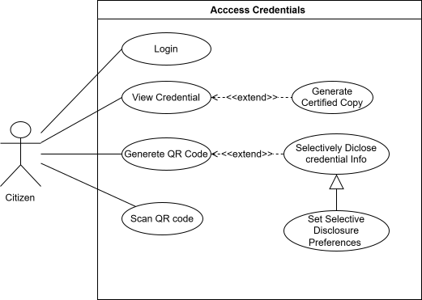

### Generate Certified Copy

**TUCBW:** This use case begins when a Citizen chooses to generate a certified copy of an Active credential.

**TUCEW:** This use case ends with a PDF containing the credential fields and a verification QR code downloaded by the Citizen, and a hash of the PDF stored for later verification. The copy is valid for 90 days.

### Verify Certified Copy

**TUCBW:** This use case begins when any person scans the QR code on a certified copy, opens its verification link, or uploads the PDF.

**TUCEW:** This use case ends with the result displayed: valid, expired, altered, or linked to a credential that is no longer Active.

### POPIA Compliance

- **Section 10 - Minimality:** QR codes and selective disclosure expose only the minimum required information.
- **Section 11 - Consent:** Citizens choose when to generate QR codes and certified copies, and which fields to disclose.
- **Section 13 - Purpose Specification:** Credential information is shared only for verification or certified copy purposes.
- **Section 19 - Security Safeguards:** Access to credentials is protected through authentication, biometric confirmation on mobile, and signed one-time QR codes.
- **Section 23 - Access to Personal Information:** Citizens can view and access their own credential information.

---
## 7. Account Management

The Account Management subsystem allows citizens to maintain their FlashID account details and security settings. This includes changing passwords, resetting forgotten passwords, updating their email address, managing trusted devices, responding to security alerts and deleting their account.

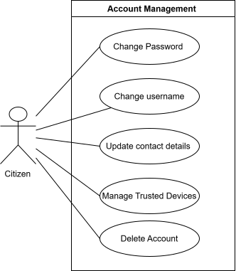

### Respond to Security Alert

**TUCBW:** This use case begins when fraud detection raises a security alert for a Citizen, for example after impossible travel between sign-ins, and the Citizen opens the alert in the mobile app.

**TUCEW:** This use case ends with the Citizen either securing the account (after re-entering their password, all sessions end, the suspicious device is removed and any QR restriction is lifted) or dismissing the alert as their own activity, and the outcome recorded in the audit log.

### POPIA Compliance

- **Section 8 - Accountability:** Email changes, password resets and security alert actions are logged and traceable.
- **Section 10 - Minimality:** Only required account and contact information should be collected or updated.
- **Section 11 - Consent:** Citizens voluntarily initiate updates to their own account information.
- **Section 19 - Security Safeguards:** Password changes, trusted device management and fraud detection protect citizen data from unauthorised access.
- **Section 23 - Access to Personal Information:** Citizens are able to access and manage their own personal account information.

---
## 8. Credentials Management

The Credentials Management subsystem allows the system and government administrators to manage the lifecycle of citizen credentials. This includes expiring driver's licences, reinstating revoked or investigated credentials, updating citizen credentials from the government registry, placing credentials under investigation, and viewing audit logs.

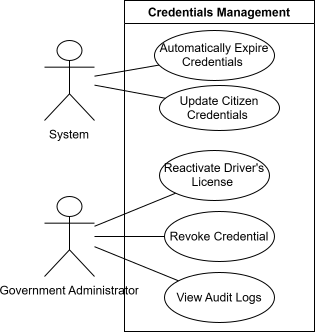

### Automatically Expire Credential

**TUCBW:** This use case begins with the system's scheduled credential expiry check running (automatically every day at 00:00 SAST, or manually triggered by a Government Administrator as a testing action) and identifying an Active driver's licence credential whose expiry date has passed.

**TUCEW:** This use case ends with the credential's status being updated to Expired, an audit log entry being recorded, and the citizen being notified of the expiration in-app.

### Update Citizen Credentials

**TUCBW:** This use case begins with the system's scheduled update citizen credentials check running (automatically every day at 00:00 SAST, or manually triggered by a Government Administrator as a testing action) and updating any credentials in FlashID that have been updated in the Government Registry.

**TUCEW:** This use case ends with the citizen's personal details and/or credentials being updated to match the Government Registry, an audit log entry being recorded for each change, and the citizen being notified of the update in-app.

### Reinstate Credential

**TUCBW:** This use case begins with a Government Administrator selecting a credential currently under Investigation or Revoked, choosing to reinstate it, and providing a reason.

**TUCEW:** This use case ends with the credential's status being restored to Active, the status change being logged to the audit log, and the citizen being notified.

### Revoke Credential

**TUCBW:** This use case begins with a Government Administrator selecting a credential to revoke or put under investigation, and providing a mandatory reason.

**TUCEW:** This use case ends with the credential's status being set to Revoked or Investigation, QR verification for that credential being rejected immediately, the change being logged to the audit log, and the citizen being notified.

### View Audit Log

**TUCBW:** This use case begins with the Government Admin clicking on the view audit log page.

**TUCEW:** This use case ends with the Government admin being able to view the audit logs in a table format.

### POPIA Compliance

- **Section 8 - Accountability:** Administrative actions must be audit logged, system-triggered actions (e.g. automatic credential expiry) are logged without a human actor, since accountability for automated processing still applies under POPIA.
- **Section 15 - Further Processing Limitation:** Credential data must only be used for valid legal, administrative, or verification purposes.
- **Section 16 - Information Quality:** Credential records must remain accurate, current, and updated when authoritative source data changes.
- **Sections 19-22 - Security Safeguards:** Only authorised administrators may update, investigate, or reinstate credentials.

---

## 9. View Dashboards

The View Dashboards subsystem allows each authenticated user type to view a role-specific landing page summarising information relevant to them: citizens see their account and activity summary, officials see their own recent activity plus their institution's audit history, and government administrators see system-wide status, counts, and analytics.

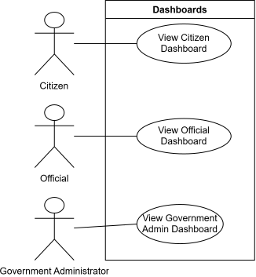

### View Citizen Dashboard

**TUCBW:** This use case begins with an authenticated Citizen navigating to their dashboard.

**TUCEW:** This use case ends with the Citizen's account summary, recent activity, and notifications displayed.

### View Official Dashboard

**TUCBW:** This use case begins with an authenticated Official navigating to their dashboard.

**TUCEW:** This use case ends with the Official's own recent activity displayed, and their institution's full audit history available to search and filter, with each such lookup itself recorded as an audit log entry.

### View Government Admin Dashboard

**TUCBW:** This use case begins with an authenticated Government Administrator navigating to their dashboard.

**TUCEW:** This use case ends with system status, headline counts, a system-wide activity feed, and analytics for the selected date range displayed.

### POPIA Compliance

- **Section 8 - Accountability:** An official viewing their institution's audit history is itself an audit-logged event, so access to that data is traceable, not just the data itself.
- **Section 10 - Minimality:** The official's institution history masks citizen ID numbers rather than displaying them in full. The admin's system-wide feed is restricted to an allow-list of institution/system-level events, excluding citizen-level data from a view that spans institution boundaries.
- **Sections 19-22 - Security Safeguards:** Each dashboard is restricted to its own role. Citizens, officials, and government administrators can't view one another's dashboard.
- **Section 23 - Access to Personal Information:** Citizens can view their own account and activity data.

---

## 10. View Government Admin Audit Logs

The Audit Logs subsystem allows an authenticated Government Administrator to view, search, and inspect the actions recorded across the platform, supporting oversight and investigation of credential, account, and institutional changes.

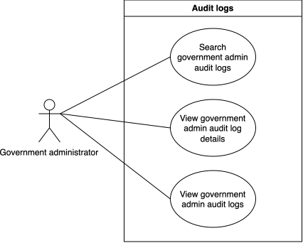

### View government admin audit logs

**TUCBW:** This use case begins with an authenticated Government Administrator navigating to the audit logs page.

**TUCEW:** This use case ends with the paginated list of audit log entries displayed, showing the timestamp, action, user, role, entity, and details.

### Search government admin audit logs

**TUCBW:** This use case begins with the Government Administrator entering a search term, choosing an action, or setting a date range while viewing the audit logs list.

**TUCEW:** This use case ends with the list filtered to matching entries, with the result count and pagination updated accordingly.

### View government admin audit log details

**TUCBW:** This use case begins with the Government Administrator selecting an entry from the audit logs list to view its details.

**TUCEW:** This use case ends with the full detail record displayed.

### POPIA Compliance

- **Section 8 - Accountability:** Audit log entries record the actor, action and time of every critical operation, so administrative oversight is based on a traceable history.
- **Sections 19-22 - Security Safeguards:** Access to audit logs is restricted to the Government Administrator role; other roles cannot view system-wide audit history.
- **Section 23 - Access to Personal Information:** Audit log entries that reference a citizen or official's actions are only accessible to administrators for legitimate oversight purposes, not for general browsing.

---

## 11. Offline Verification

The Offline Verification subsystem lets a Citizen present a credential, and an Official verify it, when neither phone has an internet connection. The credential is prepared and signed while online, bound to the Citizen's phone, and checked entirely on the Official's phone against verification data cached while online. Scans made offline are added to the audit log when the Official's phone reconnects.

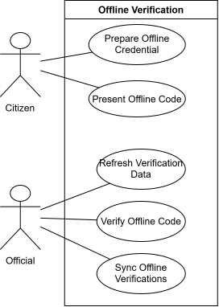

### Prepare Offline Credential

**TUCBW:** This use case begins when a signed-in Citizen opens the FlashID home screen while online.

**TUCEW:** This use case ends with a signed offline package, bound to the Citizen's phone, stored encrypted on the phone for each active credential.

### Present Offline Code

**TUCBW:** This use case begins when a Citizen chooses to share a credential and selects the offline code, with or without a connection.

**TUCEW:** This use case ends with an animated QR code showing only the chosen fields, re-signed by the Citizen's phone every 5 seconds while it is displayed.

### Refresh Verification Data

**TUCBW:** This use case begins when an Official's phone is online and the Official opens FlashID or the scanner.

**TUCEW:** This use case ends with the issuer keys and a signed revocation list stored on the Official's phone, ready for offline verification.

### Verify Offline Code

**TUCBW:** This use case begins when an Official scans a Citizen's animated offline QR code.

**TUCEW:** This use case ends with the result shown on the Official's phone: the disclosed fields and portrait when verified, or a specific reason when refused.

### Sync Offline Verifications

**TUCBW:** This use case begins when an Official's phone that made offline scans regains a connection, signs in, or returns to the foreground.

**TUCEW:** This use case ends with each queued scan recorded once in the audit log and removed from the phone.

### POPIA Compliance

- **Section 10 - Minimality:** Only the fields the Citizen chooses to share leave the phone; every other field travels as a salted digest that reveals nothing.
- **Sections 19-22 - Security Safeguards:** Offline packages are encrypted on the device and bound to the Citizen's phone, recordings stop verifying within about 90 seconds, screenshots are blocked on the sharing screen, and offline data is wiped on sign-out.
- **Section 8 - Accountability:** Every offline scan is attributed to the Official who made it and recorded in the audit log, with the phone's time and the server's receipt time.
- **Section 11 - Consent:** An offline presentation happens only when the Citizen explicitly chooses to show the offline code.

---

## 12. Fraud Detection (Impossible Travel)

The Fraud Detection subsystem protects Citizen accounts by checking every login for impossible travel: two logins from places too far apart to have travelled between in the time between them. When a login is flagged, FlashID raises a security alert, restricts QR generation, and guides the Citizen through reviewing the event and securing their account.

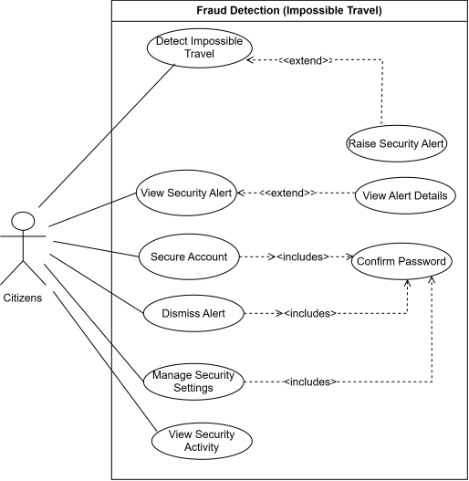

### Detect Impossible Travel

**TUCBW:** This use case begins when a User successfully logs in and FlashID records the login's approximate location, device and time.

**TUCEW:** This use case ends with the distance, time between logins and implied travel speed compared against the User's previous login, and the login given a risk score and risk level.

### Raise Security Alert

**TUCBW:** This use case begins when a login is assessed as impossible travel and impossible travel detection is enabled for the User.

**TUCEW:** This use case ends with an open fraud alert recorded against the User's account, QR generation temporarily restricted, and the alert shown on the Citizen's dashboard.

### View Security Alert

**TUCBW:** This use case begins when a Citizen with an open fraud alert opens their dashboard.

**TUCEW:** This use case ends with a "Suspicious activity detected" alert displayed, summarising the event and offering the option to review it.

### View Alert Details

**TUCBW:** This use case begins when a Citizen chooses to review a security alert.

**TUCEW:** This use case ends with the new and previous login locations, the distance, time between logins, implied travel speed, device and IP address displayed, along with guidance on how to keep the account secure.

### Secure Account

**TUCBW:** This use case begins when a Citizen chooses to secure their account from an open fraud alert and selects an action: log out other devices, reset password, or add extra verification.

**TUCEW:** This use case ends with the chosen action applied after the Citizen's password is confirmed, the alert marked as secured, and the result and next steps shown to the Citizen.

### Confirm Password

**TUCBW:** This use case begins when a Citizen attempts a sensitive security action (securing the account, dismissing an alert, or changing security settings).

**TUCEW:** This use case ends with the Citizen's password verified so the action can continue, or the action refused if the password is incorrect.

### Dismiss Alert

**TUCBW:** This use case begins when a Citizen recognises the flagged activity as their own and chooses to dismiss the alert.

**TUCEW:** This use case ends with the alert marked as dismissed after the Citizen's password is confirmed, and the alert no longer shown on the dashboard.

### Manage Security Settings

**TUCBW:** This use case begins when a Citizen opens their security settings.

**TUCEW:** This use case ends with the Citizen's choices for impossible travel detection and enhanced verification saved after their password is confirmed.

### View Security Activity

**TUCBW:** This use case begins when a Citizen opens their recent security activity.

**TUCEW:** This use case ends with a list of recent security events displayed, each showing the event type, location, time, device and risk level.

### POPIA Compliance

- **Section 8 — Accountability:** Every alert, dismissal and security action is recorded against the Citizen's account, so each decision is traceable.
- **Section 10 — Minimality:** Only the location, device and time data needed to assess login risk is processed. Locations are approximate and derived from the login's IP address.
- **Section 13 — Purpose Specification:** Login location and device data is used only to detect fraud and protect the Citizen's account.
- **Section 18 — Notification to Data Subject:** Citizens are shown exactly why an alert was raised, including the locations, times and device involved.
- **Sections 19–22 — Security Safeguards:** Suspicious logins trigger alerts and temporary QR restrictions, and sensitive actions require password confirmation.

---

## 13. Emergency QR Code

The Emergency QR Code subsystem lets a Citizen prepare an emergency profile that authorised Officials, such as paramedics and police, can open in an emergency, even straight from the Citizen's lock screen and without an internet connection. Every access requires a justification, is logged, and is reported to the Citizen and their emergency contacts.

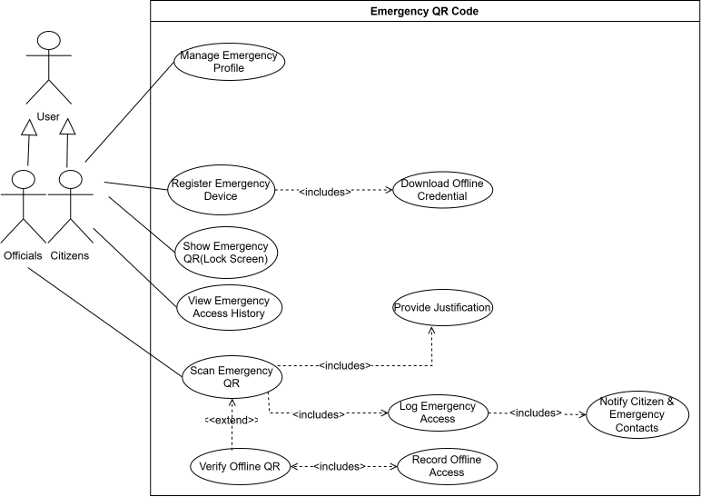

### Manage Emergency Profile

**TUCBW:** This use case begins when a Citizen opens their emergency profile in the FlashID mobile app.

**TUCEW:** This use case ends with the Citizen's emergency information and emergency contacts saved to their profile.

### Register Emergency Device

**TUCBW:** This use case begins when a Citizen chooses to enable the emergency QR code on their phone.

**TUCEW:** This use case ends with the phone registered as the Citizen's emergency device and a signed offline credential downloaded to it.

### Download Offline Credential

**TUCBW:** This use case begins when a Citizen's registered emergency device requests the signed emergency credential while online.

**TUCEW:** This use case ends with the signed offline credential stored securely on the device, ready to be shown as an emergency QR code without an internet connection.

### Show Emergency QR (Lock Screen)

**TUCBW:** This use case begins when the Citizen, or someone assisting them, opens the emergency QR code from the phone's lock screen.

**TUCEW:** This use case ends with the emergency QR code displayed on the lock screen without the phone being unlocked.

### View Emergency Access History

**TUCBW:** This use case begins when a Citizen opens their emergency access history.

**TUCEW:** This use case ends with a list of every time their emergency profile was accessed displayed, including the responder, their institution, the justification given and when it happened.

### Scan Emergency QR

**TUCBW:** This use case begins when an authorised Official scans a Citizen's emergency QR code.

**TUCEW:** This use case ends with the Citizen's emergency profile and photo displayed to the Official after a justification has been provided and the access logged, or the request refused if the code is invalid or already used.

### Provide Justification

**TUCBW:** This use case begins when an Official is asked why they need to open a Citizen's emergency profile.

**TUCEW:** This use case ends with the Official's justification recorded as part of the emergency access.

### Log Emergency Access

**TUCBW:** This use case begins when an emergency profile is opened by an Official, online or through a synced offline scan.

**TUCEW:** This use case ends with an emergency access record saved, capturing the responder, their institution, the justification, the location, whether the scan was offline, and the time.

### Notify Citizen & Emergency Contacts

**TUCBW:** This use case begins when a new emergency access has been logged.

**TUCEW:** This use case ends with an email sent to each of the Citizen's emergency contacts who has an email address and to the Citizen, informing them that the emergency profile was accessed.

### Verify Offline QR

**TUCBW:** This use case begins when an Official scans a Citizen's emergency QR code while the Official's phone has no internet connection.

**TUCEW:** This use case ends with the emergency QR code verified on the Official's phone and the emergency information displayed, with the access queued to be recorded.

### Record Offline Access

**TUCBW:** This use case begins when an Official's phone that verified an emergency QR code offline reconnects to the internet.

**TUCEW:** This use case ends with the offline access sent to FlashID and recorded as an emergency access marked as offline.

### POPIA Compliance

- **Section 8 — Accountability:** Every emergency access is attributed to the Official who performed it and recorded with their justification.
- **Section 10 — Minimality:** Only the emergency information the Citizen chose to include in their profile is shown to the responder.
- **Section 11 — Consent:** Citizens choose to create an emergency profile and enable the emergency QR code on their phone.
- **Section 13 — Purpose Specification:** Emergency information is used only to assist the Citizen in an emergency.
- **Section 18 — Notification to Data Subject:** The Citizen and their emergency contacts are emailed every time the emergency profile is opened.
- **Sections 19–22 — Security Safeguards:** Only authorised Officials can open an emergency profile, the offline credential is signed and stored securely on the device, and the Citizen's photo is shared through a short-lived, read-only link.
- **Section 23 — Access to Personal Information:** Citizens can view a full history of who accessed their emergency profile and why.

---

## 14. Certified Copy

The Certified Copy subsystem lets a Citizen generate a certified PDF copy of an active credential, instead of having a physical document certified in person. Each copy contains a verification QR code, and anyone can confirm a copy is genuine and unaltered by scanning that code or uploading the PDF.

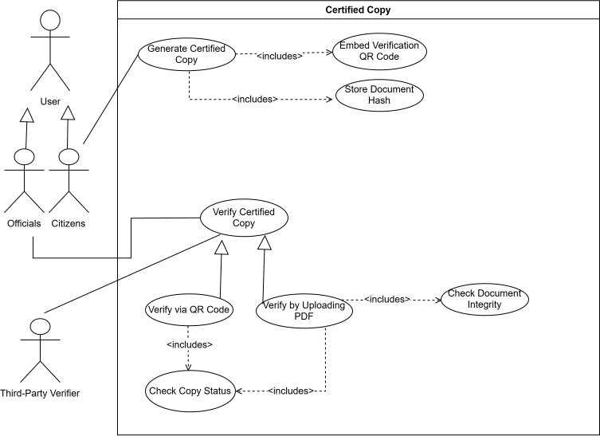

### Generate Certified Copy

**TUCBW:** This use case begins when a Citizen selects one of their Active credentials and chooses to generate a certified copy.

**TUCEW:** This use case ends with a certified PDF copy of the credential generated and downloaded by the Citizen, or the request refused if the credential is not Active or does not belong to the Citizen.

### Embed Verification QR Code

**TUCBW:** This use case begins when a certified copy is being generated.

**TUCEW:** This use case ends with a unique verification link created and printed on the PDF as a QR code.

### Store Document Hash

**TUCBW:** This use case begins when the certified copy PDF has been generated.

**TUCEW:** This use case ends with fingerprints (SHA-256 hashes) of the verification token, the credential details and the finished PDF stored, so the copy can later be verified and any changes detected.

### Verify Certified Copy

**TUCBW:** This use case begins when an Official or Third-Party Verifier chooses to check whether a certified copy is genuine.

**TUCEW:** This use case ends with the verification result displayed: whether the copy is valid, its status, and the credential details it certifies.

### Verify via QR Code

**TUCBW:** This use case begins when an Official or Third-Party Verifier scans the verification QR code printed on a certified copy.

**TUCEW:** This use case ends with the certified copy's status and certified credential details displayed on the public verification page, or the copy reported as invalid if the code does not match a FlashID certified copy.

### Verify by Uploading PDF

**TUCBW:** This use case begins when an Official or Third-Party Verifier uploads a certified copy PDF for verification.

**TUCEW:** This use case ends with the uploaded PDF confirmed as an exact, unaltered FlashID certified copy along with its status, or reported as unverifiable if it was edited or not generated by FlashID.

### Check Copy Status

**TUCBW:** This use case begins when a certified copy has been matched during verification.

**TUCEW:** This use case ends with the copy's status (Active, Expired or Revoked) determined and shown as part of the verification result.

### Check Document Integrity

**TUCBW:** This use case begins when a PDF has been uploaded for verification.

**TUCEW:** This use case ends with the PDF's fingerprint compared against the stored fingerprint, confirming whether the document has been changed in any way.

### POPIA Compliance

- **Section 10 — Minimality:** A certified copy contains only the details of the single credential the Citizen chose.
- **Section 11 — Consent:** Certified copies are generated only when the Citizen chooses to create one.
- **Section 13 — Purpose Specification:** Certified copy data is used only to produce and verify the certified copy.
- **Section 16 — Information Quality:** Copies are generated only from Active credentials, and verification reports whether a copy is still Active, Expired or Revoked.
- **Sections 19–22 — Security Safeguards:** The verification token is stored only as a hash, and document hashes make any change to a PDF detectable. Uploads are limited to genuine PDF files of up to 10 MB.
